## Cap: Easy

**Step1:**

Find open ports

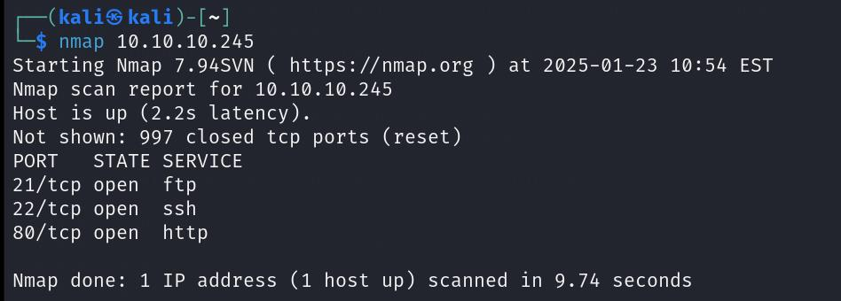

**Step2:**

Go with port 80 

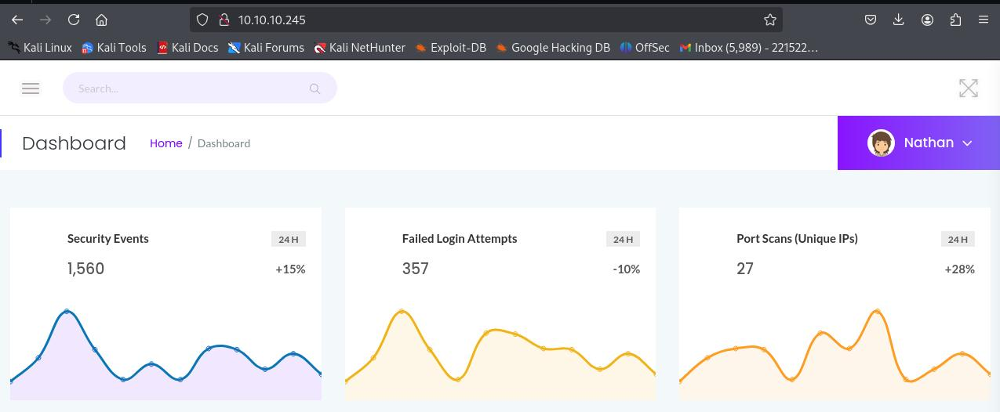

We have a web application running

Apply a directory busting to find endpoint

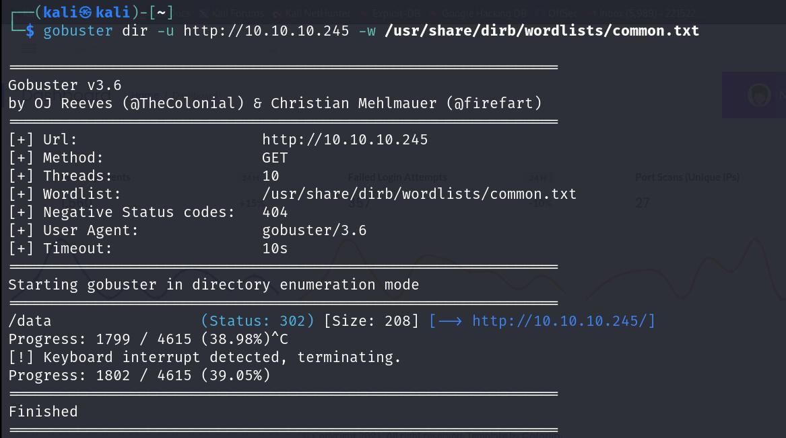

Here we have an endpoint /data

**Step3:**

On /data check any IDOR exist

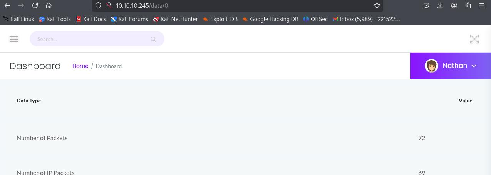

Yes, there exist an IDOR vulnerability

**Step4:**

Find all endpoint using burp suite intruder

Here result show there are endpoints, at each we have a Wireshark file with download button.

Download all file

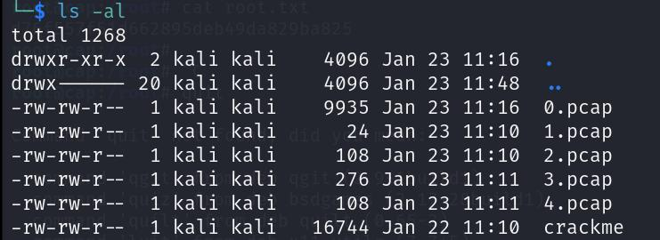

Only we are interested in 0.pcap file because it contains lots of packet where other files contain 1 or 0 packet

File at endpoint /data/0

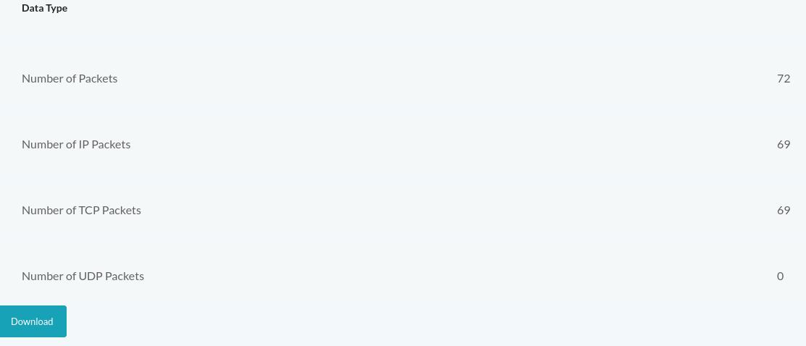

File at another endpoint have 0 or 1 packet

**Step5:**

Open file in wire shark 

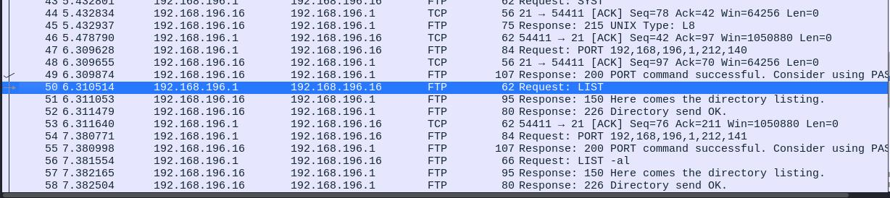

For FTP packet follow TCP stream.

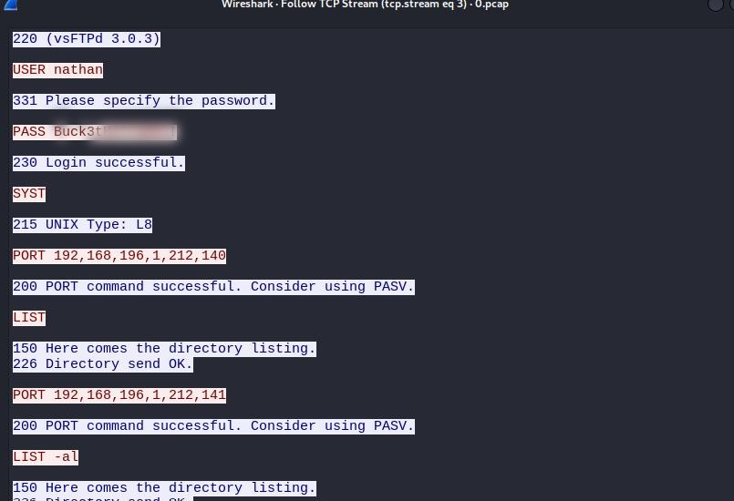

Here we can see a username and password.

As we know there is ftp and SSH running on port 21 and 22.

**Step6:**

Try with SSH first

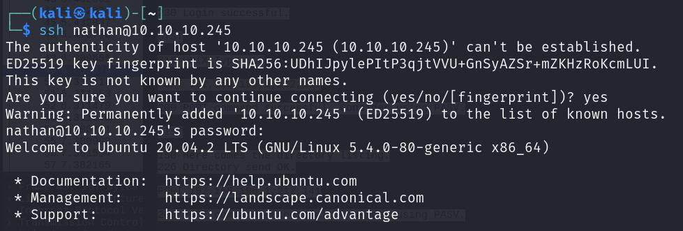

Now here we have user.txt which contain flag

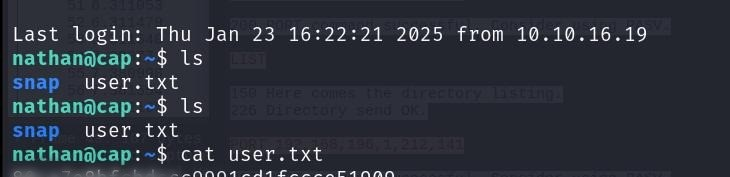

**Step7**:

Now we have to escalate privilege to be an admin or root

Now we have binary on this machine has special capabilities that can be abused to obtain root privileges.

Command: `getcap -r / 2>/dev/null`

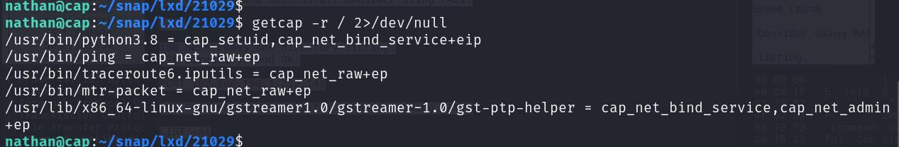

Here we see `/usr/bin/python3.8` use it to be an admin

Command: `python3.8 -c 'import os; os.setuid(0); os.system("/bin/bash")'`

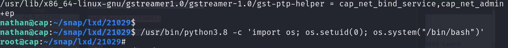

And we have flag user root

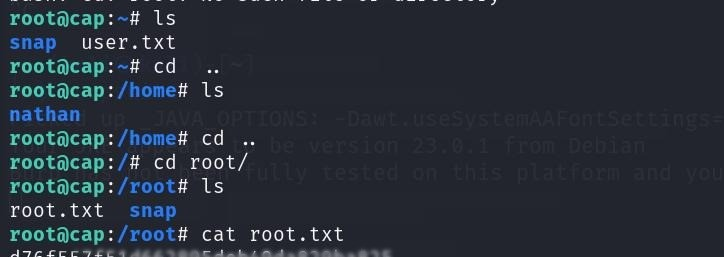
